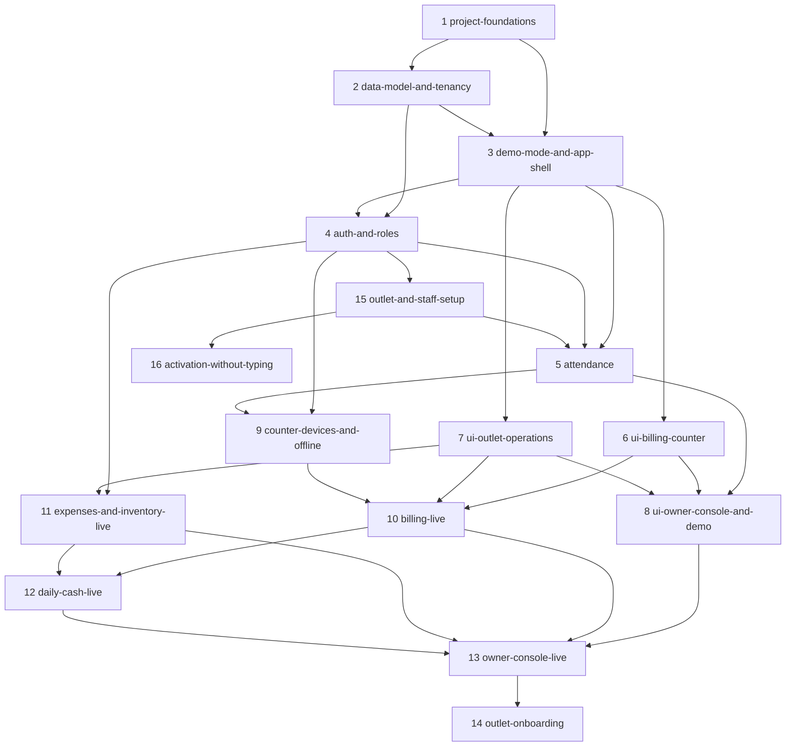

# Shawarmania Ops Roadmap — Change Sequencing & Dependency Chart

> Written 2026-07-25. Governing strategy: **make the tenancy contract right → get attendance into real use → make the whole experience demonstrable → then make each surface real.**
>
> Each change below has a proposal-level seed at `openspec/changes/<name>/proposal.md`. Expand a change with `/opsx:propose` when its turn comes; seeds for later waves are deliberately lighter so earlier gates can inform them.
>
> **Ask `/next-change`** at any time for the current recommendation: which change to do next, which model to use, and the pre-flight checklist — derived live from this file and each change folder's actual state.

## This Roadmap Is Deliberately Small

Fifteen changes is a **starting position, not a forecast.** Real work surfaces as you build: a gate fails and reveals a missing capability, a demo exposes a screen nobody thought about, a real franchisee asks for something. Planning that work now would mean deciding it with the least information anyone will ever have about it.

So this roadmap plans the spine and leaves the branches to be discovered. Expect it to grow — probably to twice this size before the app is finished. That growth is the system working, not the plan failing.

**How work enters:** a discovered need goes into [`openspec/todos/`](../todos/README.md) as a behaviour-focused note. When it is ready and its trigger has fired, `/opsx:propose` graduates it into a change folder and it gets a row here — with a number, a wave, a model, dependencies, and a gate like everything else. Nothing is sequenced before it earns a place. Its number will be the next free one; **its wave will usually not be**, since work discovered late often belongs early.

## Delivery Strategy

Three commitments shape the order below.

**Attendance goes live first.** It is what the business wants running immediately, and it is the simplest complete slice through auth, deployment and live data — a low-stakes shakedown of all three before billing depends on them.

**Every other screen is built before it is real.** Each `ui-*` change builds complete, interactive surfaces against a **mock data adapter**, behind a feature gate, so the full four-role experience is demonstrable long before the backend exists. Each later `*-live` change swaps the adapter and removes the gate. **A `*-live` change makes a screen real; it does not redesign it.** If it finds itself rebuilding UI, the mock was wrong and that is the bug to fix.

The classic way UI-first fails is designing screens the data model cannot serve. Two rules prevent it: `data-model-and-tenancy` (#2) lands before any UI, and every mock is typed from the generated schema types, so a mock that drifts fails to compile.

Note that **attendance (#5) is not split this way**. The demo-first split exists to make *undeliverable* features demonstrable; for a feature shipping immediately it would be pure ceremony.

**Feature gating has three states**, tracked in one registry:

| State | Real users see | Demo mode shows |
|---|---|---|
| `hidden` | nothing | nothing — not built yet |
| `demo` | nothing | the full mocked surface |
| `live` | the real feature | the real feature, with demo data |

Promoting a surface from `demo` to `live` is the visible outcome of every `*-live` change.

## Change Inventory

|  | # | Wave | Change | Model | Status | Hard dependencies | Checkpoint (gate) |
|---|---|---|--------|-------|--------|-------------------|-------------------|
| ✅ | 1 | A | `project-foundations` | Opus | **archived 2026-07-26** | — | fresh clone → install, test, lint, typecheck, build all green; contrast validator passes in **both** themes; the empty app installs on a real Android phone and loads its shell with the network off; a push to `main` deploys |
| ✅ | 2 | A | `data-model-and-tenancy` | **Fable** | **archived 2026-07-26** | #1 | isolation suite passes for **every** outlet-scoped table; a Franchise Admin session provably cannot read the other outlet's rows even with a hand-crafted request; both outlets seeded; TypeScript types generated |
| ✅ | 3 | A | `demo-mode-and-app-shell` | **Fable** | **archived 2026-07-27** | #1, #2 | all four role shells navigable in demo mode with a working role switcher; **a demo session provably cannot write to Supabase**; a real signed-in user cannot silently enter demo mode; the demo banner is never dismissible; a mock that drifts from schema types fails to compile |
| ✅ | 4 | B | `auth-and-roles` | Opus | **archived 2026-07-27** | #2, #3 | all four roles sign in and land on their own shell; an admin provisions a staff account end-to-end with a one-time code; deactivating an account blocks access without waiting for token expiry |
| ✅ | 5 | B | `attendance` | Opus | **archived 2026-07-27** | #3, #4, **#15** | **real staff check in and out on their own phones in production**; in-fence succeeds, out-of-fence blocks then clears via manager override recorded with who and why; an Employee sees only their own records |
|  | 6 | C | `ui-billing-counter` | Opus | seeded | #3 | a full order can be rung and settled in demo mode on a tablet viewport; whole menu visible without scrolling; optional customer fields never block settling |
|  | 7 | C | `ui-outlet-operations` | Opus | seeded | #3 | menu, inventory, expenses and a full day-close all walkable in demo mode — including a low-stock warning and a deliberate cash mismatch |
|  | 8 | C | `ui-owner-console-and-demo` | Opus | seeded | #5, #6, #7 | **a single uninterrupted walkthrough of all four roles** on a deployed URL, with internally consistent mock data — a busy trading day whose bills, stock movements, cash close and alert all reconcile with each other |
|  | 9 | D | `counter-devices-and-offline` | **Fable** | seeded | #4, #5 | an enrolled tablet reaches only its own outlet and revoke is immediate; offline → 20 bills → online → exactly 20 rows, zero duplicates; queue survives restart; a replayed UUID inserts once; an employee with no GPS fix checks in on the tablet |
|  | 10 | D | `billing-live` | **Fable** | seeded | #6, #7, #9 | a real order settles online and offline; totals match the domain tests; per-outlet bill numbers server-assigned with no gaps or collisions across two devices; a 00:20 bill carries the previous business date; a void never mutates the original |
|  | 11 | E | `expenses-and-inventory-live` | Opus | seeded | #4, #7 | a cash expense moves the day's cash figures and a UPI expense does not; the movements ledger reconciles exactly to current quantity; a correction is a movement with a note; low-stock fires at threshold |
|  | 12 | E | `daily-cash-live` | **Fable** | seeded | #10, #11 | expected closing matches the invariant from snapshotted inputs; the difference shows with the correct sign; **a bill syncing after close raises a reconciliation exception instead of rewriting a signed-off day** |
|  | 13 | E | `owner-console-live` | Opus | seeded | #8, #10, #11, #12 | both P&L modes compute on real data and **a test proves raw materials are not double-counted**; the owner compares two real outlets; the outlet switcher never leaks a third; reports reconcile exactly to on-screen figures |
|  | 14 | F | `outlet-onboarding` | Opus | seeded | #13 | a third outlet is created, staffed, tablet-enrolled and verified isolated **entirely through the UI, with zero code changes**; the runbook in `docs/OPERATIONS.md` matches what actually happened |
| ✅ | 15 | B | `outlet-and-staff-setup` | Opus | **archived 2026-07-27** | #4 | **from an empty database, entirely through the UI and with no SQL**: an owner creates an outlet, captures its position, provisions a manager and an employee, links that employee to a roster row, and the employee checks in from their own phone |
| ✅ | 16 | B | `activation-without-typing` | Opus | **archived 2026-07-27** | #4, #15 | a new employee sets their password by opening one link and typing one thing — a password — and every way of getting it wrong says which thing was wrong |
| ✅ | 17 | B | `address-autofill` | Opus | **archived 2026-07-28** | #15 | an owner creating an outlet picks their shop from a search and **every address field fills in one action** — District included, from the PIN rather than guessed; every field stays editable; the form works exactly as it does today when the lookup is unreachable; **the geofence is untouched** |
| ✅ | 18 | B | `generated-staff-codes` | Opus | **archived 2026-07-28** | #15 | an admin adds a person to the staff list **without being asked to invent anything**, the roster shows a readable code the app chose, and a Franchise Admin's attempt to change one is **refused by the database rather than by the form** |
| ✅ | 19 | B | `blank-is-not-a-value` | Opus | **archived 2026-07-28** | #15, **#20** | **a blank or whitespace-only value cannot be written into any required field from any form in the app**, and the database refuses it too — proved by a hand-crafted request, not by the form refusing; and no placeholder can be mistaken for a value already filled in |
| 🔄 | 20 | B | `outlet-deletion` | Opus | active | #15 | **an outlet with nothing attached to it is deleted from the app by the owner**, and one with anything attached refuses with a sentence naming what is still there — the refusal proved by a hand-crafted request, not by a disabled button |

**Wave column** — which [execution wave](#execution-waves) the change belongs to. The same letter appears in the change's own proposal banner (`> **Model**: … · **Wave**: …`), and the validator checks the two agree. Unlike the status cells this one is **authored, not derived**: `npm run roadmap:sync` never touches it, so a row added later must carry its own letter — and it may well be an *earlier* letter than its neighbours, since new work is numbered by arrival, not by wave. Waves are readability; **the dependency cells are law**. Where they permit more parallelism than the letters suggest, the wave notes below say so.

**Model column** — the Claude model recommended to drive each change's `/opsx:propose` and implementation session. **Opus is the default.**

**Fable** for the four changes where irreversible design judgment concentrates and a wrong call means a rewrite rather than a fix — plus billing, which every future transaction inherits:

- **#2** — the schema and RLS model is the system's foundation; every table, policy and query inherits it, and getting tenancy wrong is a security incident.
- **#3** — the adapter seam and gating contract are inherited by every remaining change, so a bad seam means rewriting every screen twice.
- **#9** — exactly-once semantics under partial failure are subtle to get right and brutal to retrofit onto a shipped queue.
- **#10** — the billing contract: snapshots, totals, numbering, business-date resolution. Every bill the business ever rings inherits it.
- **#12** — cash reconciliation invariants and the "never silently rewrite a signed-off number" rule.

**Opus** drives the other nine. Since consolidation, no change is small enough to be purely mechanical: each bundles enough scope that real judgment is involved, which is why **no change is assigned Sonnet**. If a change turns out to be trivial once expanded, that is worth noticing — it may belong merged into a neighbour.

**Status icon (leading column) & Status column** — a human-readable projection of each change's lifecycle, shown twice: a glyph in the unlabeled leading column that reads like a to-do list filling in left to right, and the same state as a word in the Status column. The four states progress from `seeded` (blank cell — proposal seed only) → `📝 proposed` (`tasks.md` present) → `🔄 active` (a task checked) → `✅ **archived YYYY-MM-DD**` (folder under `archive/`). The **source of truth is the openspec files and folders**, never these cells; both are *derived*. Every lifecycle skill runs the shared reconciler `npm run roadmap:sync` (`openspec/tools/sync-roadmap-status.mjs`), which writes the icon and the word from one derivation so they cannot drift. It self-corrects manual drift and works identically from Claude, Codex, or a plain shell.

**Definition of done for this roadmap**: every folder under `openspec/changes/` is archived, and no surface remains in the `demo` gate state.

## Dependency Graph

## Execution Waves

Changes within a wave can run in any order or in parallel; a wave starts when its members' dependencies are met.

- **Wave A — foundations (#1–#3)**: `project-foundations`, `data-model-and-tenancy`, `demo-mode-and-app-shell`. **Two keystones here.** #2 is the write contract every query inherits. #3 is the delivery contract every screen inherits — and it must come after #2 so mocks are typed from the real schema and cannot drift from it. Soft start: #2 needs only #1's *scaffold* half (repo, test harness, Supabase local), not the theme or PWA work — it may begin as soon as those tasks are checked.

- **Wave B — attendance goes live (#4, #15, #5)**: `auth-and-roles`, `outlet-and-staff-setup`, and `attendance`. **This wave ends with real staff checking in on their own phones in production** — the first genuine business value the project delivers, and a shakedown of auth, deployment and live data before billing depends on all three. #5 also registers its demo fixtures, because the Employee role's whole demo experience *is* attendance — see the note in Wave C.

  **#15 was discovered by #5 failing its own gate**, and is the clearest lesson this roadmap has produced so far. Attendance was built, tested at every layer, and deployed — and could not be used, because production had no outlet to attend and nothing in the app could create one, and because nothing ever linked an employee's login to their roster row. Both blanks were invisible to every test, since fixtures and seeds describe a business that is *already configured*. See **Configuration Surfaces** below, which exists so the next one is caught on paper.

- **Wave C — the full experience, demo-gated (#6–#8)**: `ui-billing-counter` and `ui-outlet-operations` are **fully parallel** — each builds on the shell from #3 and touches no shared state, and since they depend only on #3 they **may run alongside Wave B** if bandwidth allows. `ui-owner-console-and-demo` follows, because the scenario dataset it builds must reconcile across every surface. Its dependency on #5 is about the attendance *surfaces and fixtures*, not the production rollout — #8 may start while #5's only open items are the 🧍 live-verification gates. **This wave ends with the demo milestone**: a deployed URL where the entire four-role experience walks through coherently.

- **Wave D — the counter takes money (#9–#10)**: `counter-devices-and-offline`, then `billing-live`. #9 must land first: billing is offline-first by specification, so building settlement online-first and retrofitting a queue would mean rewriting the path the whole product depends on. #9 depends on #5 because it adds the attendance kiosk — the tablet path only makes sense once attendance itself exists.

- **Wave E — operations and insight go live (#11–#13)**: `expenses-and-inventory-live`, `daily-cash-live`, `owner-console-live`. **#12 is the payoff of the whole billing chain** — the screen that answers "is the drawer right?" — and needs both real bills and real cash expenses to mean anything. #11 depends only on #4 and #7, so it **may start alongside Wave D**.

- **Wave F — growth (#14)**: `outlet-onboarding`. **The change that proves the franchise thesis**, with a deliberately harsh gate — if a third outlet cannot be onboarded without a code change, the multi-outlet design has a defect far cheaper to find now than when a real franchisee is waiting.

## Configuration Surfaces

Every live capability needs configuration rows before it does anything, and **a mock never shows this, because fixtures arrive already configured.** That blind spot shipped a working attendance feature into a database with no outlets and no way to make one. This table is the antidote: it names each thing a live feature needs and the change that lets a human create it. **A row with no owning change is a bug in the plan, not a detail.**

| Configuration | Needed before | Created by a human in |
|---|---|---|
| Outlet row (code, name, cutover) | everything | **#15** |
| Outlet position and geofence | #5 check-in | #5 (capture screen) |
| App accounts, one-time codes | everything | #4 |
| Employee roster rows | #5 attendance | #5 |
| **Account ↔ roster link** | #5 check-in | **#15** |
| Menu categories and items | #10 billing | #7 demo → **#10 makes it real** |
| Inventory items and thresholds | #11 | #7 demo → #11 makes it real |
| Counter device enrolment | #9, #10 | #9 |
| Opening cash float | #12 | #12 |

## Standing Principles

- **No code change without a change folder.** Proposal → design → tasks → spec deltas → implementation → archive.
- **A change is not done until its docs are updated.** When a change archives, its spec delta merges into `openspec/specs/` and every affected page in `docs/` updates in the same change.
- **Every `ui-*` change ships behind the gate, against mocks typed from the schema.** A UI change that reaches for the Supabase client has broken the seam.
- **Every `*-live` change swaps an adapter and promotes a gate — it does not redesign the screen.** If it has to rebuild UI, the mock was wrong; fix the mock and record why.
- **Demo mode never writes to real data**, and a real signed-in user can never enter it silently.
- **Every outlet-scoped table ships its RLS policy and its isolation test case in the change that creates it.** Never as a follow-up.
- **Money correctness beats convenience, every time.** Integer paise, snapshotted prices, append-only bills, explicit business dates.
- **The counter never blocks.** Any change touching the billing path must leave settlement non-awaiting.
- **A gate must be reachable from an empty database.** Before calling a feature live, name every configuration row it needs and the screen a human creates it in — see [Configuration Surfaces](#configuration-surfaces). A feature that works only against pre-wired fixtures and seeds is not live; it is demonstrable.
- **Report gates honestly.** A checkpoint that was not run is not passed.
- **New work goes to `todos/` first.** Discovering scope mid-change is normal; absorbing it silently is not.

## Deferred & Demand-Gated (not seeded)

Identified future work deliberately **not** in the inventory. Nothing is sequenced or budgeted on it until the business says it is worth doing. Seed each via `/opsx:propose` only when its trigger fires.

Every item below is written up in [`openspec/todos/`](../todos/README.md) with its expectation, what already exists for it, and the open questions that need answering before it is built.

- **[`bill-thermal-printing`](../todos/bill-thermal-printing.md), [`bill-gst-breakup`](../todos/bill-gst-breakup.md), [`bill-digital-share`](../todos/bill-digital-share.md)** — the three anticipated billing extensions. The schema already carries `pricing_mode`, `tax_paise`, per-outlet `bill_number`, line-item snapshots and `customer_phone` specifically so none of these needs a historical migration. **Triggers**: a customer or regulator asks for a printed or GST bill; or the owner wants digital receipts. Deps when seeded: #10.
- **[`aggregator-settlement`](../todos/aggregator-settlement.md)** — Swiggy/Zomato revenue is recorded at order value, not net of commission, making it the largest known inaccuracy in the P&L. **Trigger**: aggregator volume grows enough to distort a decision. Deps: #13.
- **[`shared-menu-catalogue`](../todos/shared-menu-catalogue.md)** — a brand-wide master menu that outlets inherit and override. **Trigger**: enough franchises that per-outlet menu drift becomes a consistency problem; the business markets lab-tested consistency, so this carries real brand weight. Deps: #10, #14.
- **[`cross-outlet-customer-identity`](../todos/cross-outlet-customer-identity.md)** — unify a customer who visits both outlets. Deliberately parked: it requires reading across the isolation boundary the security model exists to enforce. **Trigger**: a loyalty or repeat-customer feature with real business value behind it.
- **[`audit-log`](../todos/audit-log.md)** — an immutable trail beyond the `voided_by` / `override_by` / `recorded_by` columns already on the rows. **Trigger**: the first franchise dispute, or headcount where "a small trusted team" stops being accurate.
- **[`data-retention-policy`](../todos/data-retention-policy.md)** — customer PII and attendance location data currently accumulate indefinitely. **Trigger**: meaningful customer volume, or a franchise agreement specifying retention — but see the todo, which argues a quarter of real attendance data in production fires first and matters more.
- **[`self-service-password-reset`](../todos/self-service-password-reset.md)** — admin-initiated code reissue is the whole reset story today. **Trigger**: enough staff across enough outlets that admin-initiated resets become a bottleneck. (Originally recorded as blocked on an SMS or WhatsApp channel; that was true under phone sign-in and no longer applies, since email is now the sign-in identifier.)
