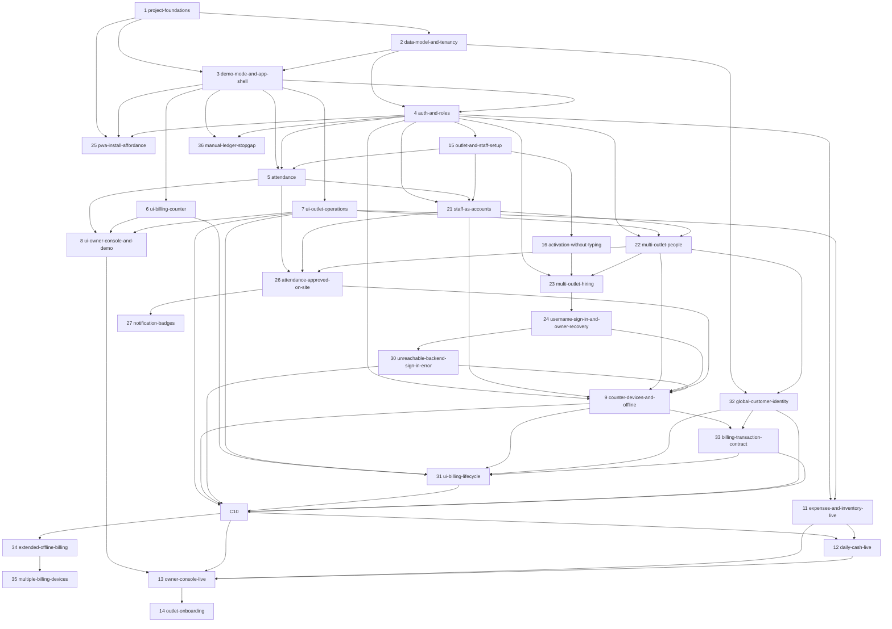

# Shawarmania Ops Roadmap — Change Sequencing & Dependency Chart

> Written 2026-07-25. Governing strategy: **make the tenancy contract right → get attendance into real use → make the whole experience demonstrable → then make each surface real.**
>
> Each change below has a proposal-level seed at `openspec/changes/<name>/proposal.md`. Expand a change with `/opsx:propose` when its turn comes; seeds for later waves are deliberately lighter so earlier gates can inform them.
>
> **Ask `/next-change`** at any time for the current recommendation: which change to do next, which model to use, and the pre-flight checklist — derived live from this file and each change folder's actual state.

## This Roadmap Is Deliberately Small

The original fifteen changes were a **starting position, not a forecast.** Real work surfaces as you build: a gate fails and reveals a missing capability, a demo exposes a screen nobody thought about, a real franchisee asks for something. Planning that work too early would mean deciding it with the least information anyone will ever have about it.

So this roadmap plans the spine and leaves the branches to be discovered. Expect it to grow — probably to twice this size before the app is finished. That growth is the system working, not the plan failing.

**How work enters:** a discovered need goes into [`openspec/todos/`](../todos/README.md) as a behaviour-focused note. When it is ready and its trigger has fired, `/opsx:propose` graduates it into a change folder and it gets a row here — with a number, a wave, a model, dependencies, and a gate like everything else. Nothing is sequenced before it earns a place. Its number will be the next free one; **its wave will usually not be**, since work discovered late often belongs early — and **its row is inserted at whatever position its dependencies place it in the topological order**, not appended at the bottom.

**What does not enter: anything that is not product.** This is a product-oriented document — it sequences capability a customer, an owner or a counter eventually sees. A bug fix does not get a row, and neither does **delivery tooling**: CI structure, lint checks, test harness work, repo scripts. Such a change still gets a change folder, a gate and a spec delta where it modifies a requirement — `ci-on-deployable-change` modified `project-scaffold` and had no row — but a number and a wave would imply it was sequenced against product work, and it was not. If you are wondering which side something falls on: ask whether shipping it changes what anyone can do with the app.

## Delivery Strategy

Three commitments shape the order below.

**Attendance goes live first.** It is what the business wants running immediately, and it is the simplest complete slice through auth, deployment and live data — a low-stakes shakedown of all three before billing depends on them.

**Every other screen is built before it is real.** Each `ui-*` change builds complete, interactive surfaces against a **mock data adapter**, behind a feature gate, so the full four-role experience is demonstrable long before the backend exists. Each later `*-live` change swaps the adapter and removes the gate. **A `*-live` change makes a screen real; it does not redesign it.** If it finds itself rebuilding UI, the mock was wrong and that is the bug to fix.

The classic way UI-first fails is designing screens the data model cannot serve. Two rules prevent it: `data-model-and-tenancy` (#2) lands before any UI, and every mock is typed from the generated schema types, so a mock that drifts fails to compile.

Note that **attendance (#5) is not split this way**. The demo-first split exists to make *undeliverable* features demonstrable; for a feature shipping immediately it would be pure ceremony.

**Feature gating has three states**, tracked in one registry:

| State | Real users see | Demo mode shows |
|---|---|---|
| `hidden` | nothing | nothing — not built yet |
| `demo` | nothing | the full mocked surface |
| `live` | the real feature | the real feature, with demo data |

Promoting a surface from `demo` to `live` is the visible outcome of every `*-live` change.

## Change Inventory

**Rows run top to bottom in topological (dependency) order** — an order you could actually execute in, not the order changes were numbered or discovered. **`#` is a stable identity**, assigned once when a change is seeded and never reused or renumbered; it is not a reading order, and it is normal for it to jump around down the table. Where the dependency graph leaves two changes free to go in either order, the tie favours the Wave grouping below, so the table reads the same way the waves do wherever the graph allows it.

|  | # | Wave | Change | Model | Status | Hard dependencies | Checkpoint (gate) |
|---|---|---|--------|-------|--------|-------------------|-------------------|
| ✅ | 1 | A | `project-foundations` | Opus | **archived 2026-07-26** | — | fresh clone → install, test, lint, typecheck, build all green; contrast validator passes in **both** themes; the empty app installs on a real Android phone and loads its shell with the network off; a push to `main` deploys |
| ✅ | 2 | A | `data-model-and-tenancy` | **Fable** | **archived 2026-07-26** | #1 | isolation suite passes for **every** outlet-scoped table; a Franchise Admin session provably cannot read the other outlet's rows even with a hand-crafted request; both outlets seeded; TypeScript types generated |
| ✅ | 3 | A | `demo-mode-and-app-shell` | **Fable** | **archived 2026-07-27** | #1, #2 | all four role shells navigable in demo mode with a working role switcher; **a demo session provably cannot write to Supabase**; a real signed-in user cannot silently enter demo mode; the demo banner is never dismissible; a mock that drifts from schema types fails to compile |
| ✅ | 4 | B | `auth-and-roles` | Opus | **archived 2026-07-27** | #2, #3 | all four roles sign in and land on their own shell; an admin provisions a staff account end-to-end with a one-time code; deactivating an account blocks access without waiting for token expiry |
| ✅ | 25 | B | `pwa-install-affordance` | **GPT-5.6 Sol** | **archived 2026-07-30** | #1, #3, #4 | an install-eligible browser shows one app-owned action in public and real shell chrome; it opens the native prompt at most once or explains iOS Safari's manual path; installed, ineligible and demo contexts show nothing; capability survives sign-in navigation; phone and counter layouts remain usable in both themes and reduced motion |
| ✅ | 15 | B | `outlet-and-staff-setup` | Opus | **archived 2026-07-27** | #4 | **from an empty database, entirely through the UI and with no SQL**: an owner creates an outlet, captures its position, provisions a manager and an employee, links that employee to a roster row, and the employee checks in from their own phone |
| ✅ | 5 | B | `attendance` | Opus | **archived 2026-07-27** | #3, #4, **#15** | **real staff check in and out on their own phones in production**; in-fence succeeds, out-of-fence blocks then clears via manager override recorded with who and why; an Employee sees only their own records |
| ✅ | 16 | B | `activation-without-typing` | Opus | **archived 2026-07-27** | #4, #15 | a new employee sets their password by opening one link and typing one thing — a password — and every way of getting it wrong says which thing was wrong |
| ✅ | 17 | B | `address-autofill` | Opus | **archived 2026-07-28** | #15 | an owner creating an outlet picks their shop from a search and **every address field fills in one action** — District included, from the PIN rather than guessed; every field stays editable; the form works exactly as it does today when the lookup is unreachable; **the geofence is untouched** |
| ✅ | 18 | B | `generated-staff-codes` | Opus | **archived 2026-07-28** | #15 | an admin adds a person to the staff list **without being asked to invent anything**, the roster shows a readable code the app chose, and a Franchise Admin's attempt to change one is **refused by the database rather than by the form** |
| ✅ | 20 | B | `outlet-deletion` | Opus | **archived 2026-07-28** | #15 | **an outlet with nothing attached to it is deleted from the app by the owner**, and one with anything attached refuses with a sentence naming what is still there — the refusal proved by a hand-crafted request, not by a disabled button |
| ✅ | 19 | B | `blank-is-not-a-value` | Opus | **archived 2026-07-28** | #15, **#20** | **a blank or whitespace-only value cannot be written into any required field from any form in the app**, and the database refuses it too — proved by a hand-crafted request, not by the form refusing; and no placeholder can be mistaken for a value already filled in |
| ✅ | 6 | C | `ui-billing-counter` | Opus | **archived 2026-07-28** | #3 | a full order can be rung and settled in demo mode on a tablet viewport; whole menu visible without scrolling; optional customer fields never block settling |
| ✅ | 7 | C | `ui-outlet-operations` | Opus | **archived 2026-07-28** | #3 | menu, inventory, expenses and a full day-close all walkable in demo mode — including a low-stock warning and a deliberate cash mismatch |
| ✅ | 8 | C | `ui-owner-console-and-demo` | Opus | **archived 2026-07-28** | #5, #6, #7 | **a single uninterrupted walkthrough of all four roles** on a deployed URL, with internally consistent mock data — a busy trading day whose bills, stock movements, cash close and alert all reconcile with each other |
| ✅ | 21 | D | `staff-as-accounts` | **Fable** | **archived 2026-07-29** | #4, #5, #15 | **staff exist only as accounts** — a person is created once, with no separate roster row or linking step anywhere in the UI; every pre-merge attendance row survives, attributed to the same person; deactivating an account ends its session without removing the person from today's attendance surface; a departed person disappears from staff lists while every record stays; deleting an account with history is **refused by the database**, proved by a hand-crafted request; no salary or payroll field exists in schema or UI; an FA records a past-time check-in for someone else and the row shows who entered it; and **the four-role demo walkthrough still walks end to end** with staff restated as accounts and the trading day still reconciling |
| ✅ | 22 | D | `multi-outlet-people` | Opus | **archived 2026-07-29** | #4, #7, #21 | **a person assigned to two outlets checks in and out at each from their own phone — nothing to switch, the fence works out where they are**; every row still records exactly who; an FA still cannot reach the other outlet's data, proved by a hand-crafted request; the owner, assigned as manager of one outlet, does that outlet's writes there and nowhere else; the owner records a non-cash expense and a stock correction remotely, each **visibly the owner's**, and anything cash from that path is refused by the database; ending one assignment leaves the other and the account untouched; **no staff code exists in schema or UI**; nobody grants themselves the owner role and the last Super Admin cannot lose it; and the four-role demo walkthrough still walks |
| ✅ | 23 | D | `multi-outlet-hiring` | **GPT-5.6 Sol** | **archived 2026-07-30** | #4, #16, **#22** | **an admin creates a person working at two outlets in one action and hands over one code that activates** — the code issued after every assignment exists, so nothing supersedes it; granting or ending an assignment for a person with an unredeemed code **visibly reissues** instead of silently killing it; an FA managing exactly one outlet sees today's form unchanged; a hand-crafted provision naming an outlet outside the caller's authority is refused; and the four-role demo walkthrough still walks |
| ✅ | 24 | D | `username-sign-in-and-owner-recovery` | **GPT-5.6 Sol** | **archived 2026-07-30** | **#23** | **an admin creates an ordinary person without email; the person opens one activation link, types the username shown there and matching new passwords, Chrome-compatible semantics can save that username/password pair, and the person signs in with it**; any account with an associated email can also sign in with that email, every Super Admin has one, every role can receive an admin-issued reset, and every existing account, assignment, password, session, invite, attendance row, and tenancy boundary survives the move |
| ✅ | 26 | D | `attendance-approved-on-site` | Opus | **archived 2026-07-31** | #5, #21, #22 | **real staff check in on their own phones in production and the day counts only once a manager approves it**; an in-fence approval on the row's own business day is one tap with no reason, and an off-site or later one is refused without a reason, proved by a hand-crafted request; a check-in past the outlet's arrival deadline records its real time and evidence and reads late; a person with no check-in reads absent once that deadline passes; **no check-out exists anywhere in schema, adapter, UI or spec**; a manager opens one person's month and its figures reconcile exactly with the same days read by day; a Franchise Admin's person view returns no rows worked at the other outlet, proved by a hand-crafted request; and the four-role demo walkthrough still walks |
| ✅ | 27 | D | `notification-badges` | Opus | **archived 2026-07-31** | **#26** | **a manager with unapproved arrivals sees a count on the Attendance nav item from another screen**, opens it, and finds those arrivals listed first; the day controls are marked only for that outlet's other unsettled days and **not** for another outlet's, proved by switching outlets and watching the marks change; the owner sees a count per outlet and reaches a stranded outlet in one tap; approving the last waiting day removes every badge rather than showing zero; a count is stale after backgrounding and correct again on return; no new colour pair enters the contrast validator; and the four-role demo walkthrough still walks |
| ✅ | 28 | D | `owner-reaches-every-outlet` | Opus | **archived 2026-08-01** | #22, #26, **#27** | **a Super Admin holding no outlet assignment opens any outlet's attendance from their own navigation**, approves a waiting day there and records a manual entry there; the same session is offered neither a day close nor a withdrawal at that outlet and the database refuses both, proved by a hand-crafted request; no Super Admin or Franchise Admin appears on an outlet's attendance day unless they hold a staff assignment at it, while a person carrying a recorded row on the day shown still appears so the count that named them can be cleared; an outlet chosen on one outlet-scoped surface is the outlet every other one opens on, after a reload, and is gone after signing out; and the four-role demo walkthrough still walks |
| ✅ | 29 | D | `attendance-one-day-per-person` | Opus | **archived 2026-08-02** | #22, #26, #27, **#28** | **a person staffed at two outlets checks in at one and is nowhere shown absent at the other** — on the manager's day, the by-staff view and their own history; the other outlet's FA sees them as working elsewhere with no outlet name, time or evidence, and is refused the underlying row by a hand-crafted request; a second row for that person on that date at either outlet is **refused by the database**, proved by a hand-crafted request; that person with no GPS and two assignments is asked which outlet and their choice waits for that outlet's manager, while a single-outlet person is never asked; the owner selects both outlets, reads one combined day where that person appears once, and approves a row at each with the fence judged per row; the owner reads that person's month and the day count reconciles exactly with the same days read by day; every filter change shows a placeholder rather than the previous outlet's rows under the new name; no new colour pair enters the contrast validator; and the four-role demo walkthrough still walks |
| ✅ | 30 | D | `unreachable-backend-sign-in-error` | **GPT-5.6 Sol** | **archived 2026-08-02** | #24 | an unreachable Auth host produces connection guidance while an unknown username and wrong password remain indistinguishable |
| ✅ | 32 | D | `global-customer-identity` | **Opus** | **archived 2026-08-02** | #2, #22 | one normalized phone identifies one business-wide customer; outlet roles retrieve only an exact full-phone match, cannot enumerate the directory or read another outlet's bills, and database tests prove the boundary |
| ✅ | 36 | D | `manual-ledger-stopgap` | **Opus** | **archived 2026-08-03** | #3, #4 | **the owner records a full trading day at each outlet from a phone** (four revenue channels, cash in and out with reasons, expenses by category, and a counted drawer), then reads that day's cash difference and the month's cash-basis operating profit with its basis named on screen; a large equipment purchase paid from the drawer leaves that day reconciled without entering the month's expenses; a Franchise Admin, Biller and Employee are refused every read and write on both tables by the database, proved by a hand-crafted request; an earlier day's edit moves no later day's stored opening cash, commission rate or expected cash; and the four-role demo walkthrough still walks |
| 📝 | 9 | D | `counter-devices-and-offline` | **Fable** | proposed | #4, #21, #22, #24, #26, **#30** | each outlet enrols exactly one billing device; normal eligible credentials create a daily billing-only grant without retaining personal authority; revoke is immediate; every accepted command commits locally and survives logout/restart |
| 📝 | 33 | D | `billing-transaction-contract` | **Fable** | proposed | #9, #32 | direct and deferred payment produce the same immutable bill; orders are device-owned/versioned; revenue and drawer dates remain distinct; retries are exact and bill plus lines commit atomically under concurrency |
| 📝 | 31 | D | `ui-billing-lifecycle` | **GPT-5.6 Sol** | proposed | #6, #7, #9, #32, **#33** | the complete immediate/deferred billing lifecycle, exact-phone autofill, history, correction, quarantine, and stranded-order recovery are walkable in demo mode without touching Supabase |
| 📝 | 10 | D | `billing-live` | **Opus** | proposed | #7, #9, #30, #31, #32, **#33** | **Billing V1:** one device at each outlet takes real immediate/deferred payments; every accepted command commits locally before UI success, survives logout/restart, lands exactly once after response loss, and only a resolved online queue can receive the device-day seal consumed by #12 |
| 📝 | 34 | D | `extended-offline-billing` | **Opus** | proposed | **#10** | **Billing V2.1:** after one online daily sign-in, the device reloads and continues through an extended outage until cutoff; twenty commands survive restart, block sign-off until reconciled, and later land exactly once; the next day still requires online reauthentication |
| 📝 | 35 | D | `multiple-billing-devices` | **Opus** | proposed | **#34** | **Billing V2.2:** two devices at one outlet bill concurrently online/offline with device-owned orders, unique sequential server numbers, isolated queues, audited transfer, independent revocation, all-device settlement seals, and proven outlet isolation |
|  | 11 | E | `expenses-and-inventory-live` | **Opus** | seeded | #4, #7 | a cash expense moves the day's cash figures and a UPI expense does not; the movements ledger reconciles exactly to current quantity; a correction is a movement with a note; low-stock fires at threshold |
|  | 12 | E | `daily-cash-live` | **Opus** | seeded | #10, #11 | a date cannot be signed off until every order is paid/cancelled, no grant remains live, and every participating device has a current resolved-queue seal; expected cash uses payment business date; the difference shows with the correct sign; a post-seal command invalidates readiness rather than rewriting a signed-off day |
|  | 13 | E | `owner-console-live` | **Opus** | seeded | #8, #10, #11, #12 | both expense-basis P&L modes compute on real data and **a test proves raw materials are not double-counted**; revenue uses original order business date while drawer/payment reports use payment business date; the owner compares two real outlets; isolation and report reconciliation hold |
|  | 14 | F | `outlet-onboarding` | **Opus** | seeded | #13 | a third outlet is created, staffed, tablet-enrolled and verified isolated **entirely through the UI, with zero code changes**; the runbook in `docs/OPERATIONS.md` matches what actually happened |

**Wave column** — which [execution wave](#execution-waves) the change belongs to. The same letter appears in the change's own proposal banner (`> **Model**: … · **Wave**: …`), and the validator checks the two agree. Unlike the status cells this one is **authored, not derived**: `npm run roadmap:sync` never touches it, so a row added later must carry its own letter — and it may well be an *earlier* letter than its neighbours, since new work is numbered by arrival, not by wave. Waves are readability; **the dependency cells are law**. Where they permit more parallelism than the letters suggest, the wave notes below say so.

**Model column** — the model recommended to drive each change's `/opsx:propose`
and implementation session. Archived rows retain their historical assignment;
the policy below applies to remaining work. **Opus is the default, GPT-5.6 Sol
handles bounded work, and Fable is an exceptional choice because it is very
expensive. Use it only where a mistake would corrupt a foundational security or
money contract inherited by every later billing change.**

**Only #9 and #33 currently clear that Fable threshold:**

- **#9** — the machine/human authority split, device revocation, daily grants,
  and durable local-acceptance boundary.
- **#33** — atomic orders/bills, idempotency, numbering, snapshots, settlement
  readiness, and both accounting clocks.

**Opus drives #32, #10, #34, #35, #11, #12, #13, and #14.** These still require
substantial security, offline, accounting, or integration judgment, but they
build on the authority and transaction contracts fixed by #9/#33: global customer
access (#32), Billing V1 integration (#10), extended-offline operation (#34),
multi-device coordination (#35), expenses/inventory (#11), cash sign-off (#12),
owner reporting/P&L (#13), and end-to-end third-outlet onboarding (#14). Revisit
Fable only if proposing or implementing one of these exposes a genuinely new
foundational invariant that #9/#33 did not settle.

**GPT-5.6 Sol drives #30 and #31.** The unreachable-backend classification (#30)
is narrow and heavily testable. The billing-lifecycle UI (#31) is broad but bounded
to typed mocks and existing design-system/adapters, with no real money write or
new authority boundary. Their complete proposals make both suitable for an
agentic coding model without paying the Fable premium.

Archived labels are not rewritten to this policy: for example, #23 and #24 remain
recorded as GPT-5.6 Sol, while earlier Opus/Fable rows remain evidence of the model
actually prescribed when those changes were delivered.

**Status icon (leading column) & Status column** — a human-readable projection of each change's lifecycle, shown twice: a glyph in the unlabeled leading column that reads like a to-do list filling in left to right, and the same state as a word in the Status column. The four states progress from `seeded` (blank cell — proposal seed only) → `📝 proposed` (`tasks.md` present) → `🔄 active` (a task checked) → `✅ **archived YYYY-MM-DD**` (folder under `archive/`). The **source of truth is the openspec files and folders**, never these cells; both are *derived*. Every lifecycle skill runs the shared reconciler `npm run roadmap:sync` (`openspec/tools/sync-roadmap-status.mjs`), which writes the icon and the word from one derivation so they cannot drift. It self-corrects manual drift and works identically from Claude, Codex, or a plain shell.

**Definition of done for this roadmap**: every folder under `openspec/changes/` is archived, and no surface remains in the `demo` gate state.

## Dependency Graph

## Execution Waves

Changes within a wave can run in any order or in parallel; a wave starts when its members' dependencies are met.

- **Wave A — foundations (#1–#3)**: `project-foundations`, `data-model-and-tenancy`, `demo-mode-and-app-shell`. **Two keystones here.** #2 is the write contract every query inherits. #3 is the delivery contract every screen inherits — and it must come after #2 so mocks are typed from the real schema and cannot drift from it. Soft start: #2 needs only #1's *scaffold* half (repo, test harness, Supabase local), not the theme or PWA work — it may begin as soon as those tasks are checked.

- **Wave B — attendance goes live (#4, #25, #15, #5)**: `auth-and-roles`, `pwa-install-affordance`, `outlet-and-staff-setup`, and `attendance`. **This wave ends with real staff checking in on their own phones in production** — the first genuine business value the project delivers, and a shakedown of auth, deployment and live data before billing depends on all three. #25 is independent polish on the already-built PWA and role shells and can run as soon as #4 is complete; it changes no data or attendance dependency. #5 also registers its demo fixtures, because the Employee role's whole demo experience *is* attendance — see the note in Wave C.

  **#15 was discovered by #5 failing its own gate**, and is the clearest lesson this roadmap has produced so far. Attendance was built, tested at every layer, and deployed — and could not be used, because production had no outlet to attend and nothing in the app could create one, and because nothing ever linked an employee's login to their roster row. Both blanks were invisible to every test, since fixtures and seeds describe a business that is *already configured*. See **Configuration Surfaces** below, which exists so the next one is caught on paper.

- **Wave C — the full experience, demo-gated (#6–#8)**: `ui-billing-counter` and `ui-outlet-operations` are **fully parallel** — each builds on the shell from #3 and touches no shared state, and since they depend only on #3 they **may run alongside Wave B** if bandwidth allows. `ui-owner-console-and-demo` follows, because the scenario dataset it builds must reconcile across every surface. Its dependency on #5 is about the attendance *surfaces and fixtures*, not the production rollout — #8 may start while #5's only open items are the 🧍 live-verification gates. **This wave ends with the demo milestone**: a deployed URL where the entire four-role experience walks through coherently.

- **Wave D — the counter takes money (#21–#24, #26–#30, #32, #9, #33, #31, #10, #34, #35)**: the people/account/attendance foundation is already complete. **#30 fixes transport-aware sign-in before credentials become the counter's daily unlock. #32 creates global customer identity without granting outlet-wide directory browse. #9 then enrols exactly one device at each outlet and establishes the billing-only daily grant plus durable local acceptance. #33 lands the atomic order/bill command contract before #31 extends the existing demo UI to the approved unpaid-order, customer, history, correction, quarantine, and recovery lifecycle. #10 is the Billing V1 milestone:** real billing goes live on one device per outlet with local-save-and-retry protection, but restart into an outage still requires online resumption. **Billing V2 is deliberately after that live milestone:** #34 adds offline restart and extended-outage work within the already-verified daily grant; #35 then removes the one-device enrollment limit after both the transaction and offline contracts are proven. #11 may still proceed independently, but #12/#13 need only Billing V1 and do not hold V1 hostage to V2.

  **#36 is in this wave by timing, not by dependency.** It needs only #3 and #4, blocks nothing, and exists because the counter is trading *now* while #10, #11 and #12 are not live: the owner records revenue, expenses and the drawer by hand so August 2026 has a month-end P&L and a daily cash check at all. It is a deliberate stopgap with a stated exit, and **#12 owns that exit** (carry its rows into the live cash and expense records, then drop the tables). It grants the owner no cash authority that survives it.

- **Wave E — operations and insight go live (#11–#13)**: `expenses-and-inventory-live`, `daily-cash-live`, `owner-console-live`. **#12 is the payoff of the whole billing chain** — the screen that answers "is the drawer right?" — and needs both real bills and real cash expenses to mean anything. #11 depends only on #4 and #7, so it **may start alongside Wave D**.

- **Wave F — growth (#14)**: `outlet-onboarding`. **The change that proves the franchise thesis**, with a deliberately harsh gate — if a third outlet cannot be onboarded without a code change, the multi-outlet design has a defect far cheaper to find now than when a real franchisee is waiting.

## Configuration Surfaces

Every live capability needs configuration rows before it does anything, and **a mock never shows this, because fixtures arrive already configured.** That blind spot shipped a working attendance feature into a database with no outlets and no way to make one. This table is the antidote: it names each thing a live feature needs and the change that lets a human create it. **A row with no owning change is a bug in the plan, not a detail.**

| Configuration | Needed before | Created by a human in |
|---|---|---|
| Outlet row (code, name, cutover) | everything | **#15** |
| Outlet position and geofence | #5 check-in | #5 (capture screen) |
| Outlet arrival deadline | #26 late and absent readings | **#26** (outlet form, defaulting to 13:00) |
| App accounts, usernames, optional account email and one-time links | everything | #4 → **#24 removes the email requirement while keeping associated email as an alternate sign-in** |
| Super Admin account email | Alternate sign-in and future recovery/security features | **#24**, private and required for every live Super Admin |
| Outlet assignments (person × role × outlet) | anyone's second outlet | **#22** (later grants) · **#23** (several at hire) |
| Employee roster rows | #5 attendance | #5 — **merged into accounts by #21**, which replaces this row and the next with a one-step People flow |
| **Account ↔ roster link** | #5 check-in | **#15** — **removed by #21**: the account *is* the staff record |
| Menu categories and items | #10 billing | #7 demo → **#10 makes it real** |
| Global customer identity by normalized phone | #10 customer reuse | **#32**, created automatically from a new exact phone; outlet roles cannot browse it |
| Inventory items and thresholds | #11 | #7 demo → #11 makes it real |
| First counter device enrolment | #9, #10 | **#9**, exactly one active device per outlet for V1 |
| Additional counter devices | #35 | **#35**, after single-device V1 and extended-offline V2.1 are proven |
| Daily billing operator grant | #10, #34, #35 | **#9**, created only by online eligible-account authentication and expiring at cutoff |
| Persisted offline bootstrap generation | #34 | **#34**, hydrated automatically after a successful online counter load |
| Device-day settlement seal | #12 sign-off | **#33 contract + #10 device flow**; one per participating device/date after online queue resolution |
| Opening cash float | #12 | #12 |
| First tracked day's opening cash and aggregator commission rates | #36 readings | **#36** (day form; every later day inherits the previous day's count and rates, editable) |

## Standing Principles

- **No code change without a change folder.** Proposal → design → tasks → spec deltas → implementation → archive.
- **A change is not done until its docs are updated.** When a change archives, its spec delta merges into `openspec/specs/` and every affected page in `docs/` updates in the same change.
- **Every `ui-*` change ships behind the gate, against mocks typed from the schema.** A UI change that reaches for the Supabase client has broken the seam.
- **Every `*-live` change swaps an adapter and promotes a gate — it does not redesign the screen.** If it has to rebuild UI, the mock was wrong; fix the mock and record why.
- **Demo mode never writes to real data**, and a real signed-in user can never enter it silently.
- **Every outlet-scoped table ships its RLS policy and its isolation test case in the change that creates it.** Never as a follow-up.
- **Money correctness beats convenience, every time.** Integer paise, snapshotted prices, append-only bills, explicit business dates.
- **The counter never blocks.** Any change touching the billing path must leave settlement non-awaiting.
- **A gate must be reachable from an empty database.** Before calling a feature live, name every configuration row it needs and the screen a human creates it in — see [Configuration Surfaces](#configuration-surfaces). A feature that works only against pre-wired fixtures and seeds is not live; it is demonstrable.
- **Report gates honestly.** A checkpoint that was not run is not passed.
- **New work goes to `todos/` first.** Discovering scope mid-change is normal; absorbing it silently is not.

## Deferred & Demand-Gated (not seeded)

Identified future work deliberately **not** in the inventory. Nothing is sequenced or budgeted on it until the business says it is worth doing. Seed each via `/opsx:propose` only when its trigger fires.

Every item below is written up in [`openspec/todos/`](../todos/README.md) with its expectation, what already exists for it, and the open questions that need answering before it is built.

- **[`bill-thermal-printing`](../todos/bill-thermal-printing.md), [`bill-gst-breakup`](../todos/bill-gst-breakup.md), [`bill-digital-share`](../todos/bill-digital-share.md)** — the three anticipated billing extensions. The schema already carries `pricing_mode`, `tax_paise`, per-outlet `bill_number`, line-item snapshots and `customer_phone` specifically so none of these needs a historical migration. **Triggers**: a customer or regulator asks for a printed or GST bill; or the owner wants digital receipts. Deps when seeded: #10.
- **[`aggregator-settlement`](../todos/aggregator-settlement.md)** — Swiggy/Zomato revenue is recorded at order value, not net of commission, making it the largest known inaccuracy in the P&L. **Trigger**: aggregator volume grows enough to distort a decision. Deps: #13, #22 — settlement figures enter through the owner's non-cash write path built there.
- **[`shared-menu-catalogue`](../todos/shared-menu-catalogue.md)** — a brand-wide master menu that outlets inherit and override. **Trigger**: enough franchises that per-outlet menu drift becomes a consistency problem; the business markets lab-tested consistency, so this carries real brand weight. Deps: #10, #14.
- **[`customer-loyalty-and-cross-outlet-insights`](../todos/customer-loyalty-and-cross-outlet-insights.md)** — #32 provides one safe global identity but deliberately no cross-outlet history, visit/spend aggregate, marketing, or reward behavior. **Trigger**: a concrete loyalty or repeat-customer decision needs activity across outlets, with its audience and franchise/privacy boundary decided first. Deps when seeded: #32, #10, and likely #13.
- **[`audit-log`](../todos/audit-log.md)** — an immutable trail beyond the `voided_by` / `override_by` / `recorded_by` columns already on the rows. **Trigger**: the first franchise dispute, or headcount where "a small trusted team" stops being accurate.
- **[`data-retention-policy`](../todos/data-retention-policy.md)** — customer PII and attendance location data currently accumulate indefinitely. **Trigger**: meaningful customer volume, or a franchise agreement specifying retention — but see the todo, which argues a quarter of real attendance data in production fires first and matters more.
- **[`self-service-account-settings`](../todos/self-service-account-settings.md)** — a signed-in person can request a username change or change a password they still know from a shared Profile/Settings surface. Forgotten passwords remain on the admin-issued one-time-link path for every role. The Biller boundary is settled: their personal account keeps staff capabilities; the enrolled counter uses a separate machine session and normal credentials to issue a daily grant, with no PIN. **Trigger**: the shared Profile/Settings surface is built or the first real request arrives. Deps: #24 and #9.
- **[`super-admin-email-recovery`](../todos/super-admin-email-recovery.md)** — add automated, enumeration-safe email recovery only after choosing and operating a real transactional-mail boundary; ordinary staff remain email-optional and recovery never becomes authority. **Trigger**: core live operations are complete, repeated owner lockouts make admin-issued reset painful, or future MFA needs security mail. Deps: #24; coordinate with self-service account settings if promoted together.
- **[`emergency-billing-continuity`](../todos/emergency-billing-continuity.md)** — a deliberately separate break-glass path for billing from an unenrolled personal device when the registered hardware is unusable. **Trigger**: a real device-loss incident or an explicit decision that the extra authority surface is worth its risk. Deps when seeded: #10, and it must not silently reuse the ordinary personal-role session.
