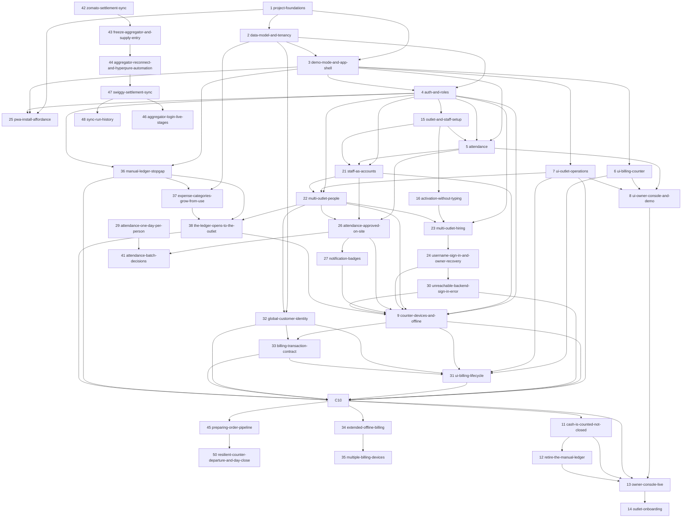

# Shawarmania Ops Roadmap — Change Sequencing & Dependency Chart

> Written 2026-07-25. Governing strategy: **make the tenancy contract right → get attendance into real use → make the whole experience demonstrable → then make each surface real.**
>
> Each change below has a proposal-level seed at `openspec/changes/<name>/proposal.md`. Expand a change with `/opsx:propose` when its turn comes; seeds for later waves are deliberately lighter so earlier gates can inform them.
>
> **Ask `/next-change`** at any time for the current recommendation: which change to do next, which model to use, and the pre-flight checklist — derived live from this file and each change folder's actual state.

## This Roadmap Is Deliberately Small

The original fifteen changes were a **starting position, not a forecast.** Real work surfaces as you build: a gate fails and reveals a missing capability, a demo exposes a screen nobody thought about, a real franchisee asks for something. Planning that work too early would mean deciding it with the least information anyone will ever have about it.

So this roadmap plans the spine and leaves the branches to be discovered. Expect it to grow — probably to twice this size before the app is finished. That growth is the system working, not the plan failing.

**How work enters:** a discovered need goes into [`openspec/todos/`](../todos/README.md) as a behaviour-focused note. When it is ready and its trigger has fired, `/opsx:propose` graduates it into a change folder and it gets a row here — with a number, a wave, a model, dependencies, and a gate like everything else. Nothing is sequenced before it earns a place. Its number will be the next free one; **its wave will usually not be**, since work discovered late often belongs early — and **its row is inserted at whatever position its dependencies place it in the topological order**, not appended at the bottom.

**What does not enter: anything that is not product.** This is a product-oriented document — it sequences capability a customer, an owner or a counter eventually sees. A bug fix does not get a row, and neither does **delivery tooling**: CI structure, lint checks, test harness work, repo scripts. Such a change still gets a change folder, a gate and a spec delta where it modifies a requirement — `ci-on-deployable-change` modified `project-scaffold` and had no row — but a number and a wave would imply it was sequenced against product work, and it was not. If you are wondering which side something falls on: ask whether shipping it changes what anyone can do with the app.

## Delivery Strategy

Three commitments shape the order below.

**Attendance goes live first.** It is what the business wants running immediately, and it is the simplest complete slice through auth, deployment and live data — a low-stakes shakedown of all three before billing depends on them.

**Every other screen is built before it is real.** Each `ui-*` change builds complete, interactive surfaces against a **mock data adapter**, behind a feature gate, so the full four-role experience is demonstrable long before the backend exists. Each later `*-live` change swaps the adapter and removes the gate. **A `*-live` change makes a screen real; it does not redesign it.** If it finds itself rebuilding UI, the mock was wrong and that is the bug to fix.

The classic way UI-first fails is designing screens the data model cannot serve. Two rules prevent it: `data-model-and-tenancy` (#2) lands before any UI, and every mock is typed from the generated schema types, so a mock that drifts fails to compile.

Note that **attendance (#5) is not split this way**. The demo-first split exists to make *undeliverable* features demonstrable; for a feature shipping immediately it would be pure ceremony.

**Feature gating has three states**, tracked in one registry:

| State | Real users see | Demo mode shows |
|---|---|---|
| `hidden` | nothing | nothing — not built yet |
| `demo` | nothing | the full mocked surface |
| `live` | the real feature | the real feature, with demo data |

Promoting a surface from `demo` to `live` is the visible outcome of every `*-live` change.

## Change Inventory

**Rows run top to bottom in topological (dependency) order** — an order you could actually execute in, not the order changes were numbered or discovered. **`#` is a stable identity**, assigned once when a change is seeded and never reused or renumbered; it is not a reading order, and it is normal for it to jump around down the table. Where the dependency graph leaves two changes free to go in either order, the tie favours the Wave grouping below, so the table reads the same way the waves do wherever the graph allows it.

|  | # | Wave | Change | Model | Status | Hard dependencies | Checkpoint (gate) |
|---|---|---|--------|-------|--------|-------------------|-------------------|
| ✅ | 1 | A | `project-foundations` | Opus | **archived 2026-07-26** | — | fresh clone → install, test, lint, typecheck, build all green; contrast validator passes in **both** themes; the empty app installs on a real Android phone and loads its shell with the network off; a push to `main` deploys |
| ✅ | 2 | A | `data-model-and-tenancy` | **Fable** | **archived 2026-07-26** | #1 | isolation suite passes for **every** outlet-scoped table; a Franchise Admin session provably cannot read the other outlet's rows even with a hand-crafted request; both outlets seeded; TypeScript types generated |
| ✅ | 3 | A | `demo-mode-and-app-shell` | **Fable** | **archived 2026-07-27** | #1, #2 | all four role shells navigable in demo mode with a working role switcher; **a demo session provably cannot write to Supabase**; a real signed-in user cannot silently enter demo mode; the demo banner is never dismissible; a mock that drifts from schema types fails to compile |
| ✅ | 4 | B | `auth-and-roles` | Opus | **archived 2026-07-27** | #2, #3 | all four roles sign in and land on their own shell; an admin provisions a staff account end-to-end with a one-time code; deactivating an account blocks access without waiting for token expiry |
| ✅ | 25 | B | `pwa-install-affordance` | **GPT-5.6 Sol** | **archived 2026-07-30** | #1, #3, #4 | an install-eligible browser shows one app-owned action in public and real shell chrome; it opens the native prompt at most once or explains iOS Safari's manual path; installed, ineligible and demo contexts show nothing; capability survives sign-in navigation; phone and counter layouts remain usable in both themes and reduced motion |
| ✅ | 15 | B | `outlet-and-staff-setup` | Opus | **archived 2026-07-27** | #4 | **from an empty database, entirely through the UI and with no SQL**: an owner creates an outlet, captures its position, provisions a manager and an employee, links that employee to a roster row, and the employee checks in from their own phone |
| ✅ | 5 | B | `attendance` | Opus | **archived 2026-07-27** | #3, #4, #15 | **real staff check in and out on their own phones in production**; in-fence succeeds, out-of-fence blocks then clears via manager override recorded with who and why; an Employee sees only their own records |
| ✅ | 16 | B | `activation-without-typing` | Opus | **archived 2026-07-27** | #4, #15 | a new employee sets their password by opening one link and typing one thing — a password — and every way of getting it wrong says which thing was wrong |
| ✅ | 17 | B | `address-autofill` | Opus | **archived 2026-07-28** | #15 | an owner creating an outlet picks their shop from a search and **every address field fills in one action** — District included, from the PIN rather than guessed; every field stays editable; the form works exactly as it does today when the lookup is unreachable; **the geofence is untouched** |
| ✅ | 18 | B | `generated-staff-codes` | Opus | **archived 2026-07-28** | #15 | an admin adds a person to the staff list **without being asked to invent anything**, the roster shows a readable code the app chose, and a Franchise Admin's attempt to change one is **refused by the database rather than by the form** |
| ✅ | 20 | B | `outlet-deletion` | Opus | **archived 2026-07-28** | #15 | **an outlet with nothing attached to it is deleted from the app by the owner**, and one with anything attached refuses with a sentence naming what is still there — the refusal proved by a hand-crafted request, not by a disabled button |
| ✅ | 19 | B | `blank-is-not-a-value` | Opus | **archived 2026-07-28** | #15, #20 | **a blank or whitespace-only value cannot be written into any required field from any form in the app**, and the database refuses it too — proved by a hand-crafted request, not by the form refusing; and no placeholder can be mistaken for a value already filled in |
| ✅ | 6 | C | `ui-billing-counter` | Opus | **archived 2026-07-28** | #3 | a full order can be rung and settled in demo mode on a tablet viewport; whole menu visible without scrolling; optional customer fields never block settling |
| ✅ | 7 | C | `ui-outlet-operations` | Opus | **archived 2026-07-28** | #3 | menu, inventory, expenses and a full day-close all walkable in demo mode — including a low-stock warning and a deliberate cash mismatch |
| ✅ | 8 | C | `ui-owner-console-and-demo` | Opus | **archived 2026-07-28** | #5, #6, #7 | **a single uninterrupted walkthrough of all four roles** on a deployed URL, with internally consistent mock data — a busy trading day whose bills, stock movements, cash close and alert all reconcile with each other |
| ✅ | 21 | D | `staff-as-accounts` | **Fable** | **archived 2026-07-29** | #4, #5, #15 | **staff exist only as accounts** — a person is created once, with no separate roster row or linking step anywhere in the UI; every pre-merge attendance row survives, attributed to the same person; deactivating an account ends its session without removing the person from today's attendance surface; a departed person disappears from staff lists while every record stays; deleting an account with history is **refused by the database**, proved by a hand-crafted request; no salary or payroll field exists in schema or UI; an FA records a past-time check-in for someone else and the row shows who entered it; and **the four-role demo walkthrough still walks end to end** with staff restated as accounts and the trading day still reconciling |
| ✅ | 22 | D | `multi-outlet-people` | Opus | **archived 2026-07-29** | #4, #7, #21 | **a person assigned to two outlets checks in and out at each from their own phone — nothing to switch, the fence works out where they are**; every row still records exactly who; an FA still cannot reach the other outlet's data, proved by a hand-crafted request; the owner, assigned as manager of one outlet, does that outlet's writes there and nowhere else; the owner records a non-cash expense and a stock correction remotely, each **visibly the owner's**, and anything cash from that path is refused by the database; ending one assignment leaves the other and the account untouched; **no staff code exists in schema or UI**; nobody grants themselves the owner role and the last Super Admin cannot lose it; and the four-role demo walkthrough still walks |
| ✅ | 23 | D | `multi-outlet-hiring` | **GPT-5.6 Sol** | **archived 2026-07-30** | #4, #16, #22 | **an admin creates a person working at two outlets in one action and hands over one code that activates** — the code issued after every assignment exists, so nothing supersedes it; granting or ending an assignment for a person with an unredeemed code **visibly reissues** instead of silently killing it; an FA managing exactly one outlet sees today's form unchanged; a hand-crafted provision naming an outlet outside the caller's authority is refused; and the four-role demo walkthrough still walks |
| ✅ | 24 | D | `username-sign-in-and-owner-recovery` | **GPT-5.6 Sol** | **archived 2026-07-30** | #23 | **an admin creates an ordinary person without email; the person opens one activation link, types the username shown there and matching new passwords, Chrome-compatible semantics can save that username/password pair, and the person signs in with it**; any account with an associated email can also sign in with that email, every Super Admin has one, every role can receive an admin-issued reset, and every existing account, assignment, password, session, invite, attendance row, and tenancy boundary survives the move |
| ✅ | 26 | D | `attendance-approved-on-site` | Opus | **archived 2026-07-31** | #5, #21, #22 | **real staff check in on their own phones in production and the day counts only once a manager approves it**; an in-fence approval on the row's own business day is one tap with no reason, and an off-site or later one is refused without a reason, proved by a hand-crafted request; a check-in past the outlet's arrival deadline records its real time and evidence and reads late; a person with no check-in reads absent once that deadline passes; **no check-out exists anywhere in schema, adapter, UI or spec**; a manager opens one person's month and its figures reconcile exactly with the same days read by day; a Franchise Admin's person view returns no rows worked at the other outlet, proved by a hand-crafted request; and the four-role demo walkthrough still walks |
| ✅ | 27 | D | `notification-badges` | Opus | **archived 2026-07-31** | #26 | **a manager with unapproved arrivals sees a count on the Attendance nav item from another screen**, opens it, and finds those arrivals listed first; the day controls are marked only for that outlet's other unsettled days and **not** for another outlet's, proved by switching outlets and watching the marks change; the owner sees a count per outlet and reaches a stranded outlet in one tap; approving the last waiting day removes every badge rather than showing zero; a count is stale after backgrounding and correct again on return; no new colour pair enters the contrast validator; and the four-role demo walkthrough still walks |
| ✅ | 28 | D | `owner-reaches-every-outlet` | Opus | **archived 2026-08-01** | #22, #26, #27 | **a Super Admin holding no outlet assignment opens any outlet's attendance from their own navigation**, approves a waiting day there and records a manual entry there; the same session is offered neither a day close nor a withdrawal at that outlet and the database refuses both, proved by a hand-crafted request; no Super Admin or Franchise Admin appears on an outlet's attendance day unless they hold a staff assignment at it, while a person carrying a recorded row on the day shown still appears so the count that named them can be cleared; an outlet chosen on one outlet-scoped surface is the outlet every other one opens on, after a reload, and is gone after signing out; and the four-role demo walkthrough still walks |
| ✅ | 29 | D | `attendance-one-day-per-person` | Opus | **archived 2026-08-02** | #22, #26, #27, #28 | **a person staffed at two outlets checks in at one and is nowhere shown absent at the other** — on the manager's day, the by-staff view and their own history; the other outlet's FA sees them as working elsewhere with no outlet name, time or evidence, and is refused the underlying row by a hand-crafted request; a second row for that person on that date at either outlet is **refused by the database**, proved by a hand-crafted request; that person with no GPS and two assignments is asked which outlet and their choice waits for that outlet's manager, while a single-outlet person is never asked; the owner selects both outlets, reads one combined day where that person appears once, and approves a row at each with the fence judged per row; the owner reads that person's month and the day count reconciles exactly with the same days read by day; every filter change shows a placeholder rather than the previous outlet's rows under the new name; no new colour pair enters the contrast validator; and the four-role demo walkthrough still walks |
| ✅ | 30 | D | `unreachable-backend-sign-in-error` | **GPT-5.6 Sol** | **archived 2026-08-02** | #24 | an unreachable Auth host produces connection guidance while an unknown username and wrong password remain indistinguishable |
| ✅ | 32 | D | `global-customer-identity` | **Opus** | **archived 2026-08-02** | #2, #22 | one normalized phone identifies one business-wide customer; outlet roles retrieve only an exact full-phone match, cannot enumerate the directory or read another outlet's bills, and database tests prove the boundary |
| ✅ | 36 | D | `manual-ledger-stopgap` | **Opus** | **archived 2026-08-03** | #3, #4 | **the owner records a full trading day at each outlet from a phone** (four revenue channels, cash in and out with reasons, expenses by category, and a counted drawer), then reads that day's cash difference and the month's cash-basis operating profit with its basis named on screen; a large equipment purchase paid from the drawer leaves that day reconciled without entering the month's expenses; a Franchise Admin, Biller and Employee are refused every read and write on both tables by the database, proved by a hand-crafted request; an earlier day's edit moves no later day's stored opening cash, commission rate or expected cash; and the four-role demo walkthrough still walks |
| ✅ | 37 | D | `expense-categories-grow-from-use` | **Opus** | **archived 2026-08-07** | #2, #36 | a category typed once at one outlet is offered from then on at both; the month groups by the text the row stored, so a rename reaches new rows only until the owner deliberately rewrites history; a merge collapses two spellings across every past month and its log says what it moved; the nine production rows arrive carrying `Hyperpure`, `Chicken` and `Staff Food` as their categories with the note left free for detail; and neither `manual_ledger_expenses` nor `expenses` still reads the enum |
| ✅ | 38 | D | `the-ledger-opens-to-the-outlet` | **Opus** | **archived 2026-08-09** | #22, #36, #37 | a Biller records a cash expense at their own outlet from their own phone and is refused yesterday's by the database; a Franchise Admin reads the full day and month at outlets they are assigned to and no others; a staff member is refused a past day's revenue, a month's aggregate and any alteration of a day's counted cash by the database, not by a hidden screen; and a voided expense stays visible, struck through, and stops counting |
| ✅ | 9 | D | `counter-devices-and-offline` | **Opus** | **archived 2026-08-09** | #4, #21, #22, #24, #26, #27, #30, #38 | each outlet sets up exactly one billing tablet and **no password is ever typed on it**; a shift opens only when the named person enters the tablet's four-digit code on their own phone, and can be ended from there; an unknown username is indistinguishable from an unconfirmed one; removing a tablet stops it at once; the tablet records an expense attributed to the shift's operator and can reach nothing else in the ledger |
| ✅ | 33 | D | `billing-transaction-contract` | **Opus** | **archived 2026-08-09** | #9, #32 | an order taken, prepared and paid and a sale paid outright produce the same immutable bill; a daily order number restarts each business day and never resembles a bill number; a retry lands the money once; a pay racing a manager's cancellation is refused with no number consumed; revenue and drawer dates stay distinct; the command envelope and its canonical hash are settled and shared by client and database; open orders and unconfirmed tablets block sign-off at the database |
| ✅ | 31 | D | `ui-billing-lifecycle` | **GPT-5.6 Sol** | **archived 2026-08-10** | #6, #7, #9, #32, #33 | the counter is one three-column workspace at every width — menu, editable current bill, then preparation-first open orders above expandable shift bills — scrolling sideways rather than folding a column into a tab, so Open orders, My shift and the Biller's read-only Menu lose their navigation entries; with line amounts, relative age, `Order #` references, order editing that moves the composer footer onto the order's own card docked against the composer while preserving any draft, primary Order and secondary Mark Paid, exact split tender, always-present method totals, editable preset cancellation reasons, a UI-only name-or-phone requirement with a refused-if-malformed phone, untruncated item names with prices at the top right and Off in place of an unsellable one, and no Card, Other or redundant latest-order card |
| ✅ | 10 | D | `billing-live` | **Opus** | **archived 2026-08-12** | #7, #9, #30, #31, #32, #33, #36, #38 | **Billing V1:** the real menu is entered through the app with no SQL; the tablet at the outlet that has one takes exact one-or-more Cash or UPI allocations, immediate and on handover, with Swiggy, Zomato, Card and Other refused by the enum rather than hidden by the UI; every accepted command commits locally before UI success, survives logout/restart and lands exactly once after response loss; only a resolved online queue receives the end-of-day confirmation consumed by #12; the ledger stops carrying an outlet's cash and UPI revenue from the day it is promoted while its typed aggregator figures stay put, **proved in the suite rather than by a production promotion** — setting a real `billing_live_from` is the runbook's and is [tracked outside this change](../todos/ledger-handover-per-outlet.md); and the Tablets surface reports the counter rather than the hardware — the live shift, who holds it and that shift's effective figures, scoped by the reader's own outlets, stated as of one reading with no subscription |
| ✅ | 40 | D | `account-lifecycle-truth-and-safe-transitions` | **GPT-5.6 Sol (high lead)** | **archived 2026-08-13** | #10, #22, #24, #30 | an admin edits a person's facts and permitted outlet roles through one truthful workflow; promotion, transfer, reset, activation, username correction, deactivation, and invalid-session recovery each do exactly what their label says without accidentally ending access; FA/SA/self/final-owner boundaries are proved by hand-crafted requests; and offline uncertainty never destroys a valid session |
| ✅ | 43 | D | `freeze-aggregator-and-supply-entry` | **Opus** | **archived 2026-08-20** | #42 | a Hyperpure order reaches the ledger exactly once whatever combination of statement re-read, ZPL recovery and re-upload it passes through, proved by replaying one order through all three; a ZPL recovery reconciles its cycle and creates no expense while a non-Hyperpure deduction still creates one; Zomato revenue and commission have no writable path from any client, proved by a hand-crafted save carrying them being refused by the database; a day with no drawer count still reads its Zomato figures for a past date; a Hyperpure purchase lands on its invoice date, or on the books' opening date where the invoice precedes it; each of the three statement shapes is parsed from a real downloaded fixture with no network access available, and the Zomato order-history parser stores neither Customer ID nor Customer Phone; an FA, Biller and Employee are each refused every new table and the statement bucket by the database, proved by a hand-crafted request; the restatement is rehearsed and leaves August's Hyperpure total at ₹85,206.37 across 16 rows; and the four-role demo walkthrough still walks. |
| ✅ | 44 | D | `aggregator-reconnect-and-hyperpure-automation` | **Ox Alpha** | **archived 2026-08-23** | #43 | the owner reconnects the aggregator once and Hyperpure's figures resume alongside Zomato's without a second sign-in or code; a reconnect asks for a one-time code only when the login actually requested one, and never asks when the session is still alive; Hyperpure's daily figures arrive on the schedule without a manual statement upload; the Hyperpure health line offers a working Reconnect again; and the four-role demo walkthrough still walks |
| ✅ | 47 | D | `swiggy-settlement-sync` | **Ox Alpha** | **archived 2026-08-25** | #44 | Kalyani's Swiggy sales appear in the ledger from two browser-free reads each day; a portal-declared closed payout cycle settles those days against the exact payout after every fee, tax, ad charge, complaint, cancellation, refund and adjustment; a headed login is used only when the independent Swiggy session genuinely needs repair; a real Swiggy annexure can reproduce the same result offline; legacy typed Swiggy history survives the handover; and an unserved outlet is shown as not connected rather than as zero trade |
| ✅ | 45 | D | `preparing-order-pipeline` | Opus | **archived 2026-08-30** | #10 | an order lands in Preparing, moves to Unpaid Prepared Orders by Mark prepared, returns by Reprepare while unpaid, and reaches Bills only once prepared and paid — offline included, with paid-but-unprepared orders staying visible in Preparing; within five minutes of payment the originating tablet can take the payment back or cancel after payment through typed atomic commands, refused outside the window and as direct writes, proved by hand-crafted requests; every post-settlement void stamps a structured kind and manager history marks Cancelled after paid; the workspace reads Menu | Bills ⇄ composer | pipeline with compact ticket cards (one primary action + kebab, ≥6 one-item cards unscrolled), flight animations with shimmer placeholders under reduced-motion suppression, the section rename carried everywhere user-visible, demo parity (provisional references, outlet-wide board, drain on subscribe), exactly-once offline replay, and the four-role demo walkthrough still walks |
| ✅ | 50 | D | `resilient-counter-departure-and-day-close` | **GPT-5.6 Sol** | **archived 2026-08-30** | #45 | Finish Day always opens a truthful readiness sheet, drains before deciding, explains every hard blocker and never waits out a tender-edit countdown; remote Leave counter ends authority immediately while device delivery stays alive; offline sales recorded afterward settle exactly once under flagged last-known operator context, never pass to the next operator, remain in the day's money and reach only manager/owner audit—not Priya's alerts |
| ✅ | 42 | D | `zomato-settlement-sync` | **Opus** | **archived 2026-08-18** | #36, #37 | both outlets' Zomato revenue arrives without being typed and reconciles to Zomato's stated payout within a rupee across two consecutive settled cycles, proved in the suite rather than by a production run; a week made not to reconcile is refused whole and leaves prior figures byte-for-byte unchanged; an order placed at 00:30 lands on the previous trading day under the outlet's own 04:00 cutover; a cycle-level tax deduction reaches no business date; a deduction expense lands on its spend date and moves no drawer figure; an FA, Biller and Employee are each refused every settlement and deduction record by the database, proved by a hand-crafted request; a historical month's totals are unchanged; and the four-role demo walkthrough still walks |
| ✅ | 41 | D | `attendance-batch-decisions` | **Opus** | **archived 2026-08-16** | #26, #29 | an FA or SA adds each waiting employee by one manual action, with no Select all and no subset shortcut, then approves or denies the explicit set atomically after confirming the named people; one fresh position is judged independently against each selected row's own outlet and date, a common reason reaches only approvals that require it, denial reads no manager position and applies one stated retry choice to all, stale or unauthorised state changes none, every person retains an immutable decision carrying a shared batch identity, and the four-role demo walkthrough still walks |
| 📝 | 34 | D | `extended-offline-billing` | **Opus** | proposed | #10 | **Billing V2.1:** after one online daily sign-in, the device reloads and continues through an extended outage until cutoff; twenty commands survive restart, block sign-off until reconciled, and later land exactly once; the next day still requires online reauthentication |
| 📝 | 35 | D | `multiple-billing-devices` | **Opus** | proposed | **#34** | **Billing V2.2:** two devices at one outlet bill concurrently online/offline with device-owned orders, unique sequential server numbers, isolated queues, audited transfer, independent revocation, all-device settlement seals, and proven outlet isolation |
| 📝 | 48 | D | `sync-run-history` | **Opus** | proposed | #47 | Zomato and Swiggy are one **Delivery** entry whose switch hides no waiting work — the entry's badge is the sum, each channel carries its own count without being selected, the channel is in the route so a link opens on it, and one channel's session, repair and history still cannot touch the other's; and every run the sync has made is readable on that surface, newest first, loaded in pages as the owner scrolls — the ones that moved figures, the ones that moved nothing, the ones that failed, the ones the owner asked for and the one happening right now; a run that moved something says what moved in ₹ and from → to, a run that failed says why in the words Needs you already speaks, and a later success stops the nagging without erasing the failures it healed; consecutive runs telling an identical story collapse to one line carrying its count and span, expandable, and never collapse across an outcome change, a run that moved a figure, a run the owner asked for, a channel or a day; and the four-role demo walkthrough still walks |
| 📝 | 46 | D | `aggregator-login-live-stages` | **Opus** | proposed | #47 | the owner watches a full sign-in move through named stages — starting, opening the partner portal, signing in as you, waiting for your code (the input field appears there), checking your code, bringing Hyperpure along, done — each arriving within seconds of the runner reaching it and without a refresh; a runner that dies mid-stage stops claiming progress rather than freezing on one; no auth-request content beyond the stage ever reaches a client; and the four-role demo walkthrough still walks |
| ✅ | 11 | E | `cash-is-counted-not-closed` | **Opus** | **archived 2026-08-29** | #10 | a count taken at 22:00 mid-service is measured against cash received up to 22:00 and no further, and the cash rung afterwards opens the next interval; the same path records a count after two skipped days and says it covers three; a count entered an hour later with an approximate time reports how much the timing could explain and names an exact bill-run coincidence as a fact, while proposing no instant when none matches, proved by a test asserting the absence; a collection takes an amount and an instant with no reason and no actor, a negative amount is cash added to a thin drawer and says so on the keystroke that makes it negative rather than at submission, and drawer cash spent on equipment takes a reason and leaves the month's operating expenses unchanged; a shortfall is recorded once and does not reach the next interval; an observation is editable until the next one anchors on it and only adjustable afterwards, with both figures readable; cash syncing into an observed interval reports beside the observation and never inside it; a Super Admin holding no assignment counts at both outlets and the record says where they stood, while a Biller and an Employee are refused every drawer read and write by the database, proved by a hand-crafted request; the Ledger renders every day with no typed field, orders the drawer by instant, names the float left and the closing balance differently, and marks an uncounted day `carried` while a date before the outlet's first count reads `not tracked yet`; an outlet's first observation is a pure anchor carrying no opening, no expected total and no difference; the migration contains no drop and no rename, so the previous surface still works at its route; and the four-role demo walkthrough still walks |
| ✅ | 49 | E | `recent-counts-bill-style` | **GPT-5.6 Sol** | **archived 2026-08-30** | #11 | each recent count is its own Billing-style card whose closed summary makes Counted, Collected and Left immediately scannable, whose contextual disclosure preserves location, notes and both correction paths without repeating that summary, whose loading silhouette reserves the same shape, and whose shared operational timestamps omit only a redundant current-year year across drawer and billing surfaces |
| 🔄 | 12 | E | `retire-the-manual-ledger` | **Opus** · GPT-5.6 Sol | active | #11 | August 2026 reads from the derived statement with the same monthly totals, row counts and counted-cash figures the notebook held, asserted inside the migration so a mismatch aborts it whole; a carried observation's counted total is its source row's count **plus** that day's collection, because the notebook counted the drawer after the collection and this model counts it before, proved against a hand-worked day; cash the notebook recorded as brought in lands inside its own day rather than raising the next opening, so `next opening = counted cash` holds on every carried row; a carried day's expected figure uses the notebook's own receipts and its own business-date expenses, because the counter was not billing for the first half of the month and re-deriving would invent a surplus on every earlier day; the chain breaks already in the production data are reported rather than repaired; every carried row keeps its recording account, correcting account, void state and reason, and recorded-from-away marker; a date before an outlet's first bill renders through the same reader, showing the business date it does have and no time of day rather than a plausible one, with that date resolved through the outlet's cutover and never read off the boundary instant it is stored at; the expense record is one table, promoted by rename with no row copied, asserted row for row across the rename; `daily_cash_records`, `cash_withdrawals`, `close_business_day()`, the readiness assertion, the closed-day shift guard and `outlets.billing_live_from` are dropped with no reader left behind; the notebook's route no longer resolves while its rows survive read-only under an archive name no role may reach; a down-migration restores the previous estate from the dump; and the four-role demo walkthrough still walks |
|  | 13 | E | `owner-console-live` | **Opus** | seeded | #8, #10, #11, **#12** | the cash-basis P&L computes on real data and names its basis, presenting a ceiling while any aggregator commission is undetermined; revenue uses original order business date while drawer reports use the drawer's own instants; the owner compares two real outlets; isolation and report reconciliation hold |
|  | 14 | F | `outlet-onboarding` | **Opus** | seeded | **#13** | a third outlet is created, staffed, tablet-enrolled and verified isolated **entirely through the UI, with zero code changes**; the runbook in `docs/OPERATIONS.md` matches what actually happened |

**Wave column** — which [execution wave](#execution-waves) the change belongs to. The same letter appears in the change's own proposal banner (`> **Model**: … · **Wave**: …`), and the validator checks the two agree. Unlike the status cells this one is **authored, not derived**: `npm run roadmap:sync` never touches it, so a row added later must carry its own letter — and it may well be an *earlier* letter than its neighbours, since new work is numbered by arrival, not by wave. Waves are readability; **the dependency cells are law**. Where they permit more parallelism than the letters suggest, the wave notes below say so.

**Model column** — the model recommended to drive each change's `/opsx:propose`
and implementation session. Archived rows retain their historical assignment;
the policy below applies to remaining work. **Opus is the default and GPT-5.6 Sol
handles bounded work.**

**Fable is no longer available**, and #9 and #33 were the two rows assigned to it.
They now read Opus. The reason they were exceptional has not gone away: a mistake
in either corrupts a contract every later billing change inherits, and the
dangerous failures are silent ones, where a policy written a clause too wide
passes every test while an Employee reads the month. **What replaces the model is
structure**, applied to those two changes and to #10:

- **Tests before implementation.** Every database rule in `tasks.md` is written as
  a failing test before the migration, function or policy that satisfies it, so
  the spec is executable rather than aspirational.
- **Sectional gates instead of one gate at the end.** Each numbered section ends
  in something provable in one sitting. #9's expense policy is a section of its
  own precisely because over-permission there is invisible.
- **An adversarial review pass before archive.** A separate session reads the
  spec deltas against the delivered code and reports every requirement it cannot
  find enforced at the database. Findings are fixed, not filed.

If a future change genuinely exceeds what that protocol covers, the answer is to
split it into smaller changes with their own gates, not to wait for a model.

**Opus drives #9, #33, #10, #34, #35, #41, #11, #12, #13 and #14.** These require
substantial security, offline, accounting or integration judgment: the tablet and
shift authority split (#9), the order and bill transaction contract (#33), Billing
V1 integration (#10), extended-offline operation (#34), multi-device coordination
(#35), atomic cross-outlet attendance decisions and manager-location evidence
(#41), the drawer as a running balance (#11), retiring the stopgap ledger (#12), owner reporting and P&L
(#13), and end-to-end third-outlet onboarding (#14).

**#38 stays Opus after its scope was cut, and the cut is not what decides it.**
Dropping pending expenses removed the accounting judgment from that change and
left it looking bounded, which is Sol's threshold. It is not bounded, because it
opens a capability that was owner-only to three further roles by rewriting the
policies that refuse them, and a policy written one predicate too wide fails
silently: an Employee reads the month, every test still passes, and nothing on
screen looks wrong. That is the "new authority boundary" the paragraph below
excludes from Sol's work. What the cut did change is where the difficulty sits.
Once `design.md` pins the full matrix of four roles against two tables against
every verb, the implementation session behind it is genuinely Sol-sized, and a
future change of this shape that inherits a settled matrix should be assigned
that way.

**GPT-5.6 Sol drives #31.** The billing-lifecycle UI is broad but bounded to typed
mocks and the existing design system and adapters, with no real money write and no
new authority boundary. Its complete proposal makes it suitable for an agentic
coding model.

**GPT-5.6 Sol at high reasoning leads #40.** The change spans a forward migration,
an existing authority boundary, Auth session lifecycle and a substantial People
workflow, so it is not bounded enough for an undirected Sol implementation. Its
proposal instead freezes the authority and transaction contracts, keeps every
security-sensitive decision and the final integration with the high-reasoning
lead, and delegates only disjoint UI, component, fixture, documentation and
contract-frozen server/test work to Sol-medium-or-lower subagents and bounded
UI/UX, accessibility, component, fixture and documentation work to Terra at
medium through xhigh reasoning.

Archived labels are not rewritten to this policy: for example, #23 and #24 remain
recorded as GPT-5.6 Sol, and earlier Opus and Fable rows remain evidence of the
model actually prescribed when those changes were delivered.

**Status icon (leading column) & Status column** — a human-readable projection of each change's lifecycle, shown twice: a glyph in the unlabeled leading column that reads like a to-do list filling in left to right, and the same state as a word in the Status column. The four states progress from `seeded` (blank cell — proposal seed only) → `📝 proposed` (`tasks.md` present) → `🔄 active` (a task checked) → `✅ **archived YYYY-MM-DD**` (folder under `archive/`). The **source of truth is the openspec files and folders**, never these cells; both are *derived*. Every lifecycle skill runs the shared reconciler `npm run roadmap:sync` (`openspec/tools/sync-roadmap-status.mjs`), which writes the icon and the word from one derivation so they cannot drift. It self-corrects manual drift and works identically from Claude, Codex, or a plain shell.

**Hard dependencies column** — a `#N` reference is **bold while that dependency is not yet archived**, so a row's still-blocking dependencies stand out from ones already cleared, and plain once the dependency archives. The dependency numbers themselves stay hand-authored — `roadmap:sync` never adds, removes, or reorders one — but the same reconciler flips the emphasis from the same archive-folder scan that derives the Status column, so the two can never disagree about what counts as done. A row with every dependency plain is fully unblocked.

**Definition of done for this roadmap**: every folder under `openspec/changes/` is archived, and no surface remains in the `demo` gate state.

## Dependency Graph

## Execution Waves

Changes within a wave can run in any order or in parallel; a wave starts when its members' dependencies are met.

- **Wave A — foundations (#1–#3)**: `project-foundations`, `data-model-and-tenancy`, `demo-mode-and-app-shell`. **Two keystones here.** #2 is the write contract every query inherits. #3 is the delivery contract every screen inherits — and it must come after #2 so mocks are typed from the real schema and cannot drift from it. Soft start: #2 needs only #1's *scaffold* half (repo, test harness, Supabase local), not the theme or PWA work — it may begin as soon as those tasks are checked.

- **Wave B — attendance goes live (#4, #25, #15, #5)**: `auth-and-roles`, `pwa-install-affordance`, `outlet-and-staff-setup`, and `attendance`. **This wave ends with real staff checking in on their own phones in production** — the first genuine business value the project delivers, and a shakedown of auth, deployment and live data before billing depends on all three. #25 is independent polish on the already-built PWA and role shells and can run as soon as #4 is complete; it changes no data or attendance dependency. #5 also registers its demo fixtures, because the Employee role's whole demo experience *is* attendance — see the note in Wave C.

  **#15 was discovered by #5 failing its own gate**, and is the clearest lesson this roadmap has produced so far. Attendance was built, tested at every layer, and deployed — and could not be used, because production had no outlet to attend and nothing in the app could create one, and because nothing ever linked an employee's login to their roster row. Both blanks were invisible to every test, since fixtures and seeds describe a business that is *already configured*. See **Configuration Surfaces** below, which exists so the next one is caught on paper.

- **Wave C — the full experience, demo-gated (#6–#8)**: `ui-billing-counter` and `ui-outlet-operations` are **fully parallel** — each builds on the shell from #3 and touches no shared state, and since they depend only on #3 they **may run alongside Wave B** if bandwidth allows. `ui-owner-console-and-demo` follows, because the scenario dataset it builds must reconcile across every surface. Its dependency on #5 is about the attendance *surfaces and fixtures*, not the production rollout — #8 may start while #5's only open items are the 🧍 live-verification gates. **This wave ends with the demo milestone**: a deployed URL where the entire four-role experience walks through coherently.

- **Wave D — the counter takes money (#21–#24, #26–#30, #32, #9, #33, #31, #10, #40, #41, #34, #35)**: the people, account and attendance foundation is already complete. **#30 fixes transport-aware sign-in before credentials matter at the counter. #32 creates global customer identity without granting outlet-wide directory browse. #9 then sets up exactly one tablet at each outlet and establishes the shift and its two-device approval. #33 lands the atomic order and bill command contract, and settles the envelope the tablet will later store, before #31 extends the existing demo UI to the order lifecycle, customer, history and correction surfaces. #10 is the Billing V1 milestone:** the real menu is entered through the app, the durable local queue is built where its adapters and screens are, and billing goes live on one tablet per outlet with local-save-and-retry protection, but a restart into an outage still requires the backend. **#40 immediately hardens the account lifecycle exposed by that milestone:** password reset, tablet approval, promotion and People editing now meet at one truthful session-and-assignment boundary before more staff or tablets are onboarded. **#41 is independent production attendance work:** it keeps the ban on Approve all while replacing repeated submissions with an atomic command over only the people a manager selected one by one, and its one contemporaneous manager position is evaluated against each selected outlet separately. **Billing V2 is deliberately after the account correction:** #34 adds offline restart and extended-outage work; #35 then removes the one-tablet limit once both the transaction and offline contracts are proven. #11 may proceed independently, and #12 and #13 need only Billing V1, so V1 is never held hostage to V2.

  **The billing chain was rescoped on 2026-08-09 after the owner described the actual counter workflow**, and the scope it lost is worth recording so nobody reinstates it by reflex. An order is a short-lived working record so the kitchen knows what to cook, paid minutes later on handover, to a walk-in customer or an aggregator's rider. It is never a tab. So **order transfer between tablets, the privileged upload-only recovery path, the optimistic-version conflict contract, and the late-payment accounting machinery are all cut**: a stranded order is cancelled by that outlet's manager with a reason, and a pay racing that cancellation is reported as a cancellation. What was added in their place is smaller and more useful: a **daily order number** the customer is called by, and a **two-device shift handshake** where the tablet takes a username and shows a four-digit code, and the named person enters that code on their own phone, so no password is ever typed on shared hardware and nobody who cannot see the tablet can open a counter. A plain approve button was rejected because a request approved by one tap is eventually approved by habit. There is deliberately **no fallback approver**, and `docs/LIMITATIONS.md` says so plainly, along with the way out: the code can be read aloud over the phone, so somebody with a flat battery can call the owner and open the counter in the owner's name, at the cost of every bill that evening carrying it.

  **The local operation store moved from #9 to #33 and then to #10, both on 2026-08-09.** It is the queue that holds a write on the tablet until the server has it. It left #9, mid-implementation, because its envelope, canonical hash and idempotency key are #33's command contract, and building it in #9 meant building it against a payload shape nothing had defined yet. It did not stop at #33, because that argument is about a **shape** and not about a storage engine. The shape stays in #33 and the canonical hash goes in `shared/`, so client and database compute the same hash. The **store** went on to #10 for three reasons: #33 promotes no gate and #31 has not built the screens, so a queue there would have nothing to hold and no surface to drive it; #33 never specified dependency ordering, which the create-revise-pay chains it introduces require and which #10 already has; and `report_counter_device_state`, shipped by #9, has no real caller until #10 turns billing on. **#33 briefly carried an `offline-operation-store` capability duplicating #10's `billing-delivery`; it was deleted rather than archived**, because two capabilities describing one queue would drift and #34 extends `billing-delivery`. So: #9 is the tablet and who is standing at it, #33 is what a write is, and #10 is the queue that carries it.

  **#36 is in this wave by timing, not by dependency.** It needs only #3 and #4, blocks nothing, and exists because the counter is trading *now* while #10, #11 and #12 are not live: the owner records revenue, expenses and the drawer by hand so August 2026 has a month-end P&L and a daily cash check at all. It was a deliberate stopgap with a stated exit, and **#12 performed that exit on 2026-08-31**: it carried the rows into the live records, promoted the expense half by rename, archived the day table read-only and removed the surface. The stopgap ran for one month, which is what a stated exit is for. The cash authority it granted the owner did not survive it as precedent: #11 decided the live drawer boundary on its own merits, and decided it the other way, with geofence evidence on the record instead of a refusal.

  **#37 and #38 are here for the same reason #36 is: the stopgap is in daily use and the business has outgrown two parts of it.** #37 comes first and touches no policy. Production proves the eight-value category enum is the wrong model (all nine expense rows are `raw_materials`, while the free-text field beside them holds the three categories actually being used), and `expenses` is still empty, so converting both tables off the enum was free at the time. #38 then opens the Ledger to Franchise Admins at outlets they manage and gives outlet staff their own expenses surface, so the person who spends the money is the person who records it. **They are sequenced rather than bundled deliberately**: #37 is a column migration against live rows and #38 is a rewrite of the six policies on the same two tables, and `migrate` is forward-only. Splitting lets the data migration soak under real nightly use before a permissions change lands on top of it, and gives each half a gate that can be verified in one sitting. **#38 grew what #12 owed at retirement** from amounts and dates to attribution, void state and the recorded-from-away marker. It also, unintentionally, made the stopgap's expense table the better of the two, which is why #12 promoted it by rename rather than migrating its rows into the empty original — the carry-over that would have lost the most was the one that looked like the tidy option.

- **Wave E — operations and insight go live (#11–#13)**: `cash-is-counted-not-closed`, `retire-the-manual-ledger`, `owner-console-live`. **#11 is the payoff of the whole billing chain**, the surface that answers "is the drawer right?", and it needs real bills to mean anything, which is its only dependency.

  **What #11 measured while it was built, on August 2026 production data.** The old day-close model was not merely awkward, it was quantifiably wrong: placing a 22:00 count on every real trading date, ₹740 at Kalyani and ₹3,900 at Kanchrapara had been rung *after* the count, so `close_business_day()` would have reported ₹4,640 of shortfall in one month on drawers that were never short. At Kanchrapara that is the ordinary case rather than an edge — 8 of its 13 cash dates traded past 22:00. The production notebook's opening-cash chain was also already broken in eleven places, which is why the surface reports a break and repairs nothing rather than treating that as a hypothetical safeguard.

  **#11 and #12 replaced the changes that used to hold these numbers**, and the replacement was a rewrite rather than an amendment. `daily-cash-live` and `expenses-and-inventory-live` were both written before billing went live, before the aggregator syncs landed, before #28, and before the owner described how cash is actually collected: an admin arrives once a day at a time of their choosing, mid-shift, counts the drawer, takes most of it, leaves a float, sometimes skips a day or two, and sometimes enters what they saw an hour later from home. The calendar day was never the unit of cash truth, so day close is replaced by a continuous drawer balance observed at instants, and the Ledger stops being a form. What remained of `expenses-and-inventory-live` was absorbed: its expense half was already delivered by #36 and #38, and its inventory half is shelved (`openspec/todos/inventory-is-shelved.md`).

  **They are two changes rather than one because the split is the safety property.** #11 creates tables and adds nullable columns and does nothing else, so it reverts by opening a different tab, with the previous Ledger still live at its own route and every notebook row untouched. #12 carries August across, renames, archives and drops, none of which a gate edit can undo. The owner asked for one push and a fast way back; that is #11. #12 waited until the derived statement had been read against the notebook on real trading days, and spent #11's cheap revert deliberately when it had.

  **What #12 found by rehearsing against production rather than against the schema** is worth keeping, because each item would have been invisible in a local test. The notebook counted the drawer *after* the nightly collection while the drawer model counts it before, so a direct copy would have understated every carried observation by that day's collection. Cash the owner recorded as brought in was inside the count already, so treating it as the observation's own movement would have inflated the next day's opening by the top-up and charged the same amount to the difference twice — production settles it: both such rows sit on the first counted day at each outlet and both balance to nought only if the addition is inside the count. Neither counter was billing before 12 and 14 August, so re-deriving a carried day's receipts from bills would have reported the drawer as thousands of rupees over on fifteen of the thirty-two carried days. And an expense's `occurred_at` is when somebody typed it, not when it was spent, so matching expenses to an interval by instant moved whole days of them into the wrong night. The notebook's own figures, read by business date, are what make the carried month reproduce the month it came from.

- **Wave F — growth (#14)**: `outlet-onboarding`. **The change that proves the franchise thesis**, with a deliberately harsh gate — if a third outlet cannot be onboarded without a code change, the multi-outlet design has a defect far cheaper to find now than when a real franchisee is waiting.

## Configuration Surfaces

Every live capability needs configuration rows before it does anything, and **a mock never shows this, because fixtures arrive already configured.** That blind spot shipped a working attendance feature into a database with no outlets and no way to make one. This table is the antidote: it names each thing a live feature needs and the change that lets a human create it. **A row with no owning change is a bug in the plan, not a detail.**

| Configuration | Needed before | Created by a human in |
|---|---|---|
| Outlet row (code, name, cutover) | everything | **#15** |
| Outlet position and geofence | #5 check-in | #5 (capture screen) |
| Outlet arrival deadline | #26 late and absent readings | **#26** (outlet form, defaulting to 13:00) |
| App accounts, usernames, optional account email and one-time links | everything | #4 → **#24 removes the email requirement while keeping associated email as an alternate sign-in** |
| Super Admin account email | Alternate sign-in and future recovery/security features | **#24**, private and required for every live Super Admin |
| Outlet assignments (person × role × outlet) | anyone's second outlet | **#22** (later grants) · **#23** (several at hire) |
| Employee roster rows | #5 attendance | #5 — **merged into accounts by #21**, which replaces this row and the next with a one-step People flow |
| **Account ↔ roster link** | #5 check-in | **#15** — **removed by #21**: the account *is* the staff record |
| Menu categories, items and prices | #10 billing | #7 demo → **#10 makes the editor real and the owner enters both outlets' menus through it.** Nothing sells until this exists, and it must not arrive by SQL |
| Global customer identity by normalized phone | #10 customer reuse | **#32**, created automatically from a new exact phone; outlet roles cannot browse it |
| Inventory items and thresholds | none | #7 demo only. **Shelved** (`openspec/todos/inventory-is-shelved.md`); nothing makes it real until the business asks |
| First counter tablet | #9, #10 | **#9**, set up with a one-time code the admin generates on their own phone; exactly one active tablet per outlet for V1 |
| Additional counter tablets | #35 | **#35**, after single-tablet V1 and extended-offline V2.1 are proven |
| A shift on the counter | #10, #34, #35 | **#9**, opened by a username on the tablet and the tablet's four-digit code entered on the operator's own phone, expiring at cutover. **No fallback approver exists**, so an eligible person with a working phone must be standing at the tablet |
| Persisted offline bootstrap generation | #34 | **#34**, hydrated automatically after a successful online counter load |
| The tablet's end-of-day confirmation | none | **#33 contract + #10 tablet flow**; one per participating tablet and date, after the queue reaches the server. It no longer gates anything on the cash side: #11 removed day close, and #12 drops the readiness assertion that consumed it |
| An outlet's billing go-live date | none | **#10**, and **dropped by #12**. Its only reader was the manual ledger form's decision to ask for typed Cash and UPI; the derived statement reads bills at every outlet without it |
| Opening cash float | #11 | **#11**, once per outlet, as the anchor for that outlet's first drawer observation. Every later opening is the previous observation's carry-forward, stored rather than derived |
| First tracked day's opening cash and aggregator commission rates | #36 readings | **#36** (day form; every later day inherited the previous day's count and rates, editable). **Retired by #12**: the day form is gone, commission is a measured amount rather than a rate, and an outlet's first drawer count is its anchor |

## Standing Principles

- **No code change without a change folder.** Proposal → design → tasks → spec deltas → implementation → archive.
- **A change is not done until its docs are updated.** When a change archives, its spec delta merges into `openspec/specs/` and every affected page in `docs/` updates in the same change.
- **Every `ui-*` change ships behind the gate, against mocks typed from the schema.** A UI change that reaches for the Supabase client has broken the seam.
- **Every `*-live` change swaps an adapter and promotes a gate — it does not redesign the screen.** If it has to rebuild UI, the mock was wrong; fix the mock and record why.
- **Demo mode never writes to real data**, and a real signed-in user can never enter it silently.
- **Every outlet-scoped table ships its RLS policy and its isolation test case in the change that creates it.** Never as a follow-up.
- **Money correctness beats convenience, every time.** Integer paise, snapshotted prices, append-only bills, explicit business dates.
- **The counter never blocks.** Any change touching the billing path must leave settlement non-awaiting.
- **A gate must be reachable from an empty database.** Before calling a feature live, name every configuration row it needs and the screen a human creates it in — see [Configuration Surfaces](#configuration-surfaces). A feature that works only against pre-wired fixtures and seeds is not live; it is demonstrable.
- **Report gates honestly.** A checkpoint that was not run is not passed.
- **New work goes to `todos/` first.** Discovering scope mid-change is normal; absorbing it silently is not.

## Deferred & Demand-Gated (not seeded)

Identified future work deliberately **not** in the inventory. Nothing is sequenced or budgeted on it until the business says it is worth doing. Seed each via `/opsx:propose` only when its trigger fires.

Every item below is written up in [`openspec/todos/`](../todos/README.md) with its expectation, what already exists for it, and the open questions that need answering before it is built.

- **[`bill-thermal-printing`](../todos/bill-thermal-printing.md), [`bill-gst-breakup`](../todos/bill-gst-breakup.md), [`bill-digital-share`](../todos/bill-digital-share.md)** — the three anticipated billing extensions. The schema already carries `pricing_mode`, `tax_paise`, per-outlet `bill_number`, line-item snapshots and `customer_phone` specifically so none of these needs a historical migration. **Triggers**: a customer or regulator asks for a printed or GST bill; or the owner wants digital receipts. Deps when seeded: #10.
- **[`aggregator-settlement`](../todos/aggregator-settlement.md)** — Swiggy/Zomato trade is not billed at all after #10 withdrew aggregator tender; it is typed into the ledger per day with its own commission rate, so the P&L figure is already net, but nothing reconciles it against a real payout and no item-level sales picture exists for those orders. **Trigger**: a payout disagrees with the ledger, or the missing item detail changes a menu decision. Deps: #13, #22 — settlement figures enter through the owner's non-cash write path built there.
- **[`shared-menu-catalogue`](../todos/shared-menu-catalogue.md)** — a brand-wide master menu that outlets inherit and override. **Trigger**: enough franchises that per-outlet menu drift becomes a consistency problem; the business markets lab-tested consistency, so this carries real brand weight. Deps: #10, #14.
- **[`customer-loyalty-and-cross-outlet-insights`](../todos/customer-loyalty-and-cross-outlet-insights.md)** — #32 provides one safe global identity but deliberately no cross-outlet history, visit/spend aggregate, marketing, or reward behavior. **Trigger**: a concrete loyalty or repeat-customer decision needs activity across outlets, with its audience and franchise/privacy boundary decided first. Deps when seeded: #32, #10, and likely #13.
- **[`audit-log`](../todos/audit-log.md)** — an immutable trail beyond the `voided_by` / `override_by` / `recorded_by` columns already on the rows. **Trigger**: the first franchise dispute, or headcount where "a small trusted team" stops being accurate.
- **[`data-retention-policy`](../todos/data-retention-policy.md)** — customer PII and attendance location data currently accumulate indefinitely. **Trigger**: meaningful customer volume, or a franchise agreement specifying retention — but see the todo, which argues a quarter of real attendance data in production fires first and matters more.
- **[`self-service-account-settings`](../todos/self-service-account-settings.md)** — a signed-in person can request a username change or change a password they still know from a shared Profile/Settings surface. Forgotten passwords remain on the admin-issued one-time-link path for every role. The Biller boundary is settled: their personal account keeps staff capabilities; the enrolled counter uses a separate machine session and normal credentials to issue a daily grant, with no PIN. **Trigger**: the shared Profile/Settings surface is built or the first real request arrives. Deps: #24 and #9.
- **[`super-admin-email-recovery`](../todos/super-admin-email-recovery.md)** — add automated, enumeration-safe email recovery only after choosing and operating a real transactional-mail boundary; ordinary staff remain email-optional and recovery never becomes authority. **Trigger**: core live operations are complete, repeated owner lockouts make admin-issued reset painful, or future MFA needs security mail. Deps: #24; coordinate with self-service account settings if promoted together.
- **[`emergency-billing-continuity`](../todos/emergency-billing-continuity.md)** — a deliberately separate break-glass path for billing from an unenrolled personal device when the registered hardware is unusable. **Trigger**: a real device-loss incident or an explicit decision that the extra authority surface is worth its risk. Deps when seeded: #10, and it must not silently reuse the ordinary personal-role session.
